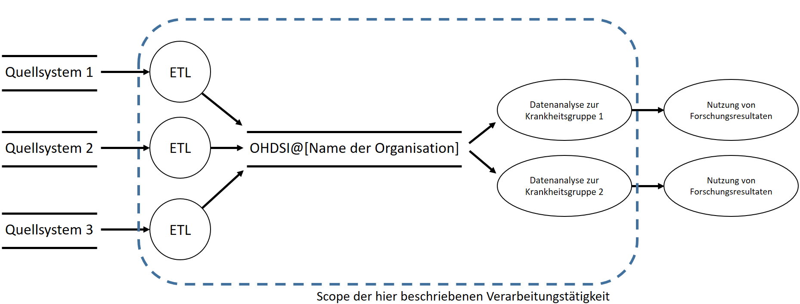

<H1> Eintrag ins Verfahrensverzeichnis: OHDSI-Implementierung </H1>

Verantwortlich(e):  
Autor(en):  
Version:  
Datum:  

# Inhaltsverzeichnis

**1 Überblick und Zweck**

1.1 Zweck dieses Dokumentes

1.2 Überblick der Verarbeitungstätigkeit

1.3 Zweck der Verarbeitungstätigkeit

1.4 Geltungsbereich der Verarbeitungstätigkeit

1.5 Rahmendaten

1.6 Beteiligte Personengruppen

1.7 Beteiligte Daten/Datenkategorie/Quelle/Rechtsgrundlage

1.8 Einwilligung

**2 Systematische Beschreibung der Verarbeitungstätigkeit**

2.1 Grafische Darstellung der Verarbeitungstätigkeit

2.2 Beschreibung der Verarbeitungsschritte

2.2.1 Schritt 1: Transformation und Laden

2.2.2 Schritt 2: Nutzung der Analysetools

2.3 IT-Infrastruktur, Systeme und Anwendung sowie Zugriffsberechtigungen

2.4 Datenfluss-Diagramm

**3 Auftragsdatenverarbeitung**

**4 Datenübermittlung an Drittländer**

**5 Speicherung, Löschung und Weitergabe von Daten**

5.1 Speicherort, Speicherdauer und Löschung der Daten

5.2 Empfänger der Daten

5.2.1 Empfänger innerhalb der Organisation

5.2.2 Empfänger außerhalb der Organisation

**6 Wahrung der Betroffenenrechte**

6.1 Information des Betroffenen

6.2 Widerruf der Einwilligung

6.3 Auskunftsrecht

6.4 Recht auf Berichtigung

6.5 Recht auf Löschung

6.6 Recht auf Einschränkung der Verarbeitung

6.7 Recht auf Datenübertragbarkeit

6.8 Widerspruchsrecht

**7 Referenzen**

# Anlagenverzeichnis

| Nr  | Titel                                                                                                                                                                                                                                   |
|-----|-----------------------------------------------------------------------------------------------------------------------------------------------------------------------------------------------------------------------------------------|
| A1  | Eintrag ins Verfahrensverzeichnis der Forschungsdatenbank OHDSI@[_Name der Organisation eintragen_]                                                                                                           |
| A2  | Leitlinie zur Informationssicherheit der Organisation [_Hier soll auf die entsprechenden allgemeine Regeln zur Informationssicherheit der Organisation verwiesen werden_].                                    |
| A3  | Zentrale technische und organisatorische Maßnahmen zur Gewährleistung des Datenschutzes. \[_Hier soll auf die entsprechenden allgemeine Regeln zur Informationssicherheit der Organisation verwiesen werden_]. |
| A4  | Berechtigungskonzept der Forschungsdatenbank OHDSI@\[_Name der Organisation eintragen_].                                                                                                                       |
| A5  | [_Falls zutreffend_] Auftragsdatenverarbeitungsverträge                                                                                                                                                       |

# Überblick und Zweck 

## Zweck dieses Dokumentes

Das vorliegende Dokument beschreibt alle Datenschutzrelevanten Aspekte
der Implementierung der unten beschriebenen Forschungsdatenbank in
[_Name der Organisation_]- im Folgenden
schlicht als „die Organisation“ bezeichnet.

## Überblick der Verarbeitungstätigkeit

Die Verarbeitungstätigkeit umfasst eine Gesundheitsdatenbank auf Basis
des Observational Medical Outcomes Partnership (OMOP) Common Data Model
(CDM) und der damit verbundenen Tools des Observational Health Data
Sciences and Informatics (OHDSI) Programms. Beim OMOP CDM handelt es
sich um ein international abgestimmtes Datenbankschema, in dem Daten aus
der Krankenversorgung und der medizinischen Forschung in strukturierter
und standardisierter Form abgelegt und so der medizinischen Forschung
über einfach zu bedienende graphische Werkzeuge (OHDSI-Tools) zugängig
gemacht werden können. Um eine weltweite Vergleichbarkeit der Daten zu
erreichen, werden diese außerdem mit einer Reihe gängiger
Interoperabilitätsstandards repräsentiert, u.a. Logical Observation
Identifiers Names and Codes (LOINC) sowie Systematized Nomenclature of
Medicine (SNOMED) Clinical Terms (CT).

Die Forschungsdatenbank ermöglicht grundsätzlich die Bearbeitung einer
Vielzahl von wissenschaftlichen Fragestellungen auf Basis
hochstandardisierter und qualitätsgesicherter Daten aus der
Krankenversorgung. Im praktischen Einsatz ist das Spektrum an
Anwendungsfällen natürlich durch die in der Datenbank abgebildeten Daten
bestimmt. Ein wichtiger Vorteil der Nutzbarmachung von
„Real-World-Daten“ liegt darin, dass im Unterschied zu reinen
Forschungsdaten ein deutlich größerer, heterogenerer (damit klinisch
valider) Datensatz für Auswertungen zur Verfügung steht. Weiterhin
ermöglicht die Standardisierung der Daten, sich im Rahmen großer
internationaler Initiativen und Projekte, wie OHDSI und EHDEN, an
umfangreichen, weltweit durchgeführten Real-World-Evidence Studien zu
beteiligen, wobei die Anonymität der in der Datenbank abgebildeten
Patientinnen und Patienten strikt gewahrt bleibt. Neben den genannten
Netzwerken werden die Technologien von OHDSI zunehmend auch in weiteren
Projekten eingesetzt und bspw. im Rahmen von EU-Förderungen als
Grundlage empfohlen (für mehr Details zur OHDSI-Methodik, Netzwerken und
Tools siehe \[1\]).

Ohne die Durchführung der in diesem Dokument beschriebenen
Verarbeitungstätigkeit ist die wissenschaftliche Sekundärnutzung von
Forschungsdaten nur eingeschränkt möglich. Insbesondere kann sich die
Organisation perspektivisch an großen Projekten und den internationalen
Real-World-Evidence-Netzwerken OHDSI und EHDEN nicht beteiligen. OHDSI
ist mit 160 Partneruniversitäten in 30 Ländern das größte
Real-World-Evidence-Netzwerk der Welt. Im Gegensatz zu einigen
kommerziellen Angeboten, die zunehmend auf den Markt drängen, ist es
offen und legt einen starken Wert auf Datenschutz. Weiterhin wird um
OHDSI herum eine lebendige Wissenschaftscommunity gepflegt, die in den
Jahren 2019-2020 ca. 80 technische und medizinische Publikationen
hervorgebracht hat. Die Organisation beraubt sich bei Nichtteilnahme
einer großen Chance und erleidet Wettbewerbsnachteile.

## Zweck der Verarbeitungstätigkeit

**Fachliche Tätigkeiten:** Die zu etablierende Forschungsdatenbank
bietet Forschenden der Organisation Funktionen zur wissenschaftlichen
Nutzung von pseudonymisierten Daten aus Krankenversorgung und Forschung.
Wichtige Funktionen umfassen: (1) Identifikation von
Datenqualitätsproblemen, (2) Möglichkeit zur Nutzung der OHDSI -Tools
zur Datenanalyse und Beantwortung verschiedener
Forschungsfragestellungen mittels gängiger statistischer Methoden (3)
Möglichkeit der Teilnahme an großen, internationalen
Forschungsprojekten, die große Datenbestände verteilt und unter
ausschließlichem Austausch von aggregierten Auswertungsergebnissen im
Sinne einer Meta-Analyse (d.h. Wahrung der Anonymität der Patientinnen
und Patienten) auswerten. Diese fachliche Tätigkeit finden auf
Projektbasis statt, so dass für jede Durchführung ein formales Projekt
[_Falls Ethikvotum notwendig: inklusive gesondertem
Ethikantrag_] definiert wird.

**Einordnung der Verarbeitungstätigkeit:** Die Verarbeitungstätigkeit
setzt eine Anbindung an die Gesundheitsdaten verarbeitende Quellsysteme
der Organisation voraus, die pseudonymisierte Daten für eine Nutzung in
OMOP/OHDSI bereitstellen. [_Hier kurz beschreiben,
wie die Verarbeitungstätigkeit im Kontext der IT der Organisation
einzuordnen ist, bspw. „die Verarbeitungstätigkeit setzt auf bereits
vorhandene Prozesse der vorhandenen IT-Zentralfunktion der Organisation
auf“ oder „für die Verarbeitungstätigkeit wurden eigens Prozesse
implementiert“, etc._]

[_Hier kurz beschreiben, ob andere
Verarbeitungstätigkeiten der Organisation von der hier beschriebenen
Verarbeitungstätigkeit abhängt._]

**Prozesseigner und -beteiligte:**

[_In diesem Abschnitt sind beteiligte Personen und ihre Rollen zu 
beschreiben. Dazu gehören bspw.:_

- _Bereitsteller der technischen Infrastruktur und ihre Rollen._

- _Für Betrieb und Wartung verantwortliche und ihre weiteren Rollen._

- _Klinische Partner und ihre Rollen. Diese haben häufig die Hoheit
  über die Verwendung der Daten in der Forschungsdatenbank. Hier ist
  insbesondere zu beachten, dass Daten unterschiedlicher fachlich
  verantwortlicher Einrichtungen in einer OHDSI-Installation gespeichert
  werden können. Ein Zugriff soll dann getrennt pro Bereich erfolgen_

- _Auftragnehmer und ihre Rollen._]

## Geltungsbereich der Verarbeitungstätigkeit

Vorausgehenden Verarbeitungstätigkeiten (VT): Die Erfassung von
medizinischen Daten im mittels einzelner Systeme der Organisation durch
entsprechendes Personal sowie die Pseudonymisierung und Bereitstellung
der Daten aus dem Quellsystem für die Forschungsdatenbank.

[_Hier ist in wenigen Sätzen zu nennen, wo die
Forschungsdatenbank betrieben wird. Dies kann bspw. im internen Netzwerk
der Organisation, in einer demilitarisierten Zone, im offenen Netz oder
auf dedizierter Hardware sein. Ein Verweis auf die entsprechend
festgelegten technischen und organisatorischen Maßnahmen dieser
Infrastruktur sollte ergänzt und in den Anhang aufgenommen
werden._] Basierend auf einer Instanz des relationalen
Datenbankmanagementsystems [_Hier Datenbankmanagementsystems, z.B. 
PostgreSQL_] werden verschieden Funktionalitäten durch verschiedene 
weitere open-source Werkzeuge bereitgestellt:

- ATLAS ist ein webbasiertes Tool, das von der OHDSI-Gemeinschaft
  entwickelt wurde und das Design und die Durchführung von
  wissenschaftlichen Analysen ermöglicht.

- HADES ist eine Sammlung von R-Paketen, die Funktionen bieten, die
  zusammen verwendet werden können, um eine vollständige
  Beobachtungsstudie, ausgehend von Daten im OMOP CDM, durchzuführen und
  Schätzungen und unterstützende Statistiken, Abbildungen und Tabellen
  zu erstellen.

- DATA QUALITY DASHBOARD verwendet eine harmonisierte Terminologie zur
  Bewertung der Qualität der Daten, die im OMOP CDM vorliegen.

- ACHILLES ist ein Software-Tool, das die Charakterisierung und
  Visualisierung einer CDM-konformen Datenbank ermöglicht.

Zur Administration und Beladung der Datenbank kommen weitere Werkzeuge zum Einsatz:

- ATHENA ermöglicht sowohl die Suche als auch das Laden von
  standardisierten Vokabularen.

- WHITERABBIT und RABBIT-IN-A-HAT sind Software-Tools, die bei der
  Vorbereitung von Ladeprozessen helfen.

- USAGI ist ein Tool, das den manuellen Prozess der Erstellung einer
  Standardisierungsregel für Daten unterstützt. Es kann auf der
  Grundlage der textlichen Ähnlichkeit zu Elementen von
  Standardterminologien Zuordnungsvorschläge machen.

Die Nutzung der Softwarelösungen erfolgt ausschließlich von Rechnern die
für die Verarbeitung von pseudonymisierten Forschungsdaten nach den
zentralen Vorgaben der Organisation zugelassen sind oder über
web-basierte Oberflächen mittels verschlüsselter Verbindungen (HTTPS
oder SSH).

**Anschließende Verarbeitungstätigkeiten (VT):** Im Anschluss an die
Nutzung der OHDSI-Plattform erfolgt die Dissemination der durchgeführten
Datenanalysen, bspw. in Form der Erstellung von Publikationen. Dieser
Prozess findet in der Verantwortung der Forschenden statt und kann bspw.
die Nutzung der Forschungsdienste der Organisation beinhalten,
Primärdaten gemäß *Good Scientific Practice* für 10 Jahre sicher zu
archivieren. Die Daten in der Forschungsdatenbank selbst werden nur
durch den Standard-Backup-Mechanismus der Betriebsumgebung der
Forschungsdatenbank durch die [_Verantwortliche
Funktion für ein zentrales Backup in der entsprechenden Betriebsumgebung
der Forschungsdatenbank nennen, bspw. IT-Zentralfunktion_]
gesichert. Für den Gesamtdatenbestand findet darüber hinaus keine
Archivierung statt. Bei der Durchführung einzelner Forschungsvorhaben
durch Forschende liegt die Verantwortung für die Archivierung der in der
Studie genutzten Daten bei den Forschenden selbst und muss u.a. im
Studienprotokoll [_Falls Ethikvotum notwendig: bzw.
im Ethikantrag_] beschrieben werden. Es gelten also alle
Standardanforderungen der Organisation und es stehen die üblichen
Dienste für die Durchführung entsprechender Studien zur Verfügung.

## Rahmendaten

| Anzahl der an der Erstellung der Datenbank beteiligten Personen:       | Ca. […] |
|------------------------------------------------------------------------|-------------------------------------|
| Anzahl der an der Administration der Datenbank beteiligten Personen:   | Ca. […] |
| Anzahl der Personen, die die Datenbank zu Forschungszwecken nutzen     | Ca. […] |
| Anzahl der betroffenen Patientinnen und Patienten/Personen/Fallzahlen: | Ca. […] |

## Beteiligte Personengruppen

[_Hier wird den jeweiligen beteiligten Personengruppen die entsprechenden 
Rollen in der Verarbeitungstätigkeit zugeordnet. Die „Rolle in der 
Verarbeitungstätigkeit“ beschreibt dabei, welche Art von Aufgaben hier 
aufgeführt werden sollen._]

| Nr.                             | Bezeichnung der Personengruppe                 | Rolle in der Verarbeitungstätigkeit                                          |
|---------------------------------|------------------------------------------------|------------------------------------------------------------------------------|
| 1     | [_Personengruppe 1_] | [_z.B. Systemdesign, Datenpflege_]                 |
| 2     | [_Personengruppe 2_] | [_z.B. Datenanalyse, Berichterstattung_]           |
| 3     | [_Personengruppe 3_] | [_z.B. Zugriffsverwaltung, Administration_]        |
| 4     | [_Personengruppe 4_] | [_z.B. Datenbereitstellung, Teilnahme an Studien_] |
| […] | […]                | […]                                             |

## Beteiligte Daten/Datenkategorie/Quelle/Rechtsgrundlage

Im Rahmen des Projektes werden relevante Daten aus
[_Hier relevante Systeme aufzuzählen, bspw.
Krankenhausinformationssystem, Register, etc._] extrahiert, in
die Struktur von OMOP/OHDSI überführt und in der Forschungsdatenbank
abgelegt werden. Es erfolgt ausschließlich eine Sekundärnutzung von
bereits im Rahmen der Krankenversorgung erfassten Daten. Im Folgenden
werden die Datenkategorien umfassend erläutert.

[_Im Folgenden sollen die Datenkategorien umfassend
erläutert werden. Jede Kategorie erfordert eine präzise Beschreibung
ihrer Inhalte, wobei konkrete Beispiele die Anschaulichkeit und das
Verständnis verbessern. Es ist entscheidend, die Herkunft der Daten
exakt zu benennen, sei es aus internen Systemen der Patientenverwaltung
oder externen Quellen wie Datenbanken öffentlicher Einrichtungen.
Abschließend muss die rechtliche Grundlage für den Umgang mit diesen
Daten dargelegt werden, um Konformität mit geltenden Datenschutzvorgaben
sicherzustellen._]

1.  [_z.B. Stammdaten_]

    1.  [_Beschreibung/Details/Spezifikation/Beispiele_]

    2.  [_Quellsystem_]

    3.  [_Rechtgrundlage der Verarbeitung_]

2.  [_Datenkategorie 2_]

    1.  [_Beschreibung/Details/Spezifikation/Beispiele_]

    2.  [_Quellsystem_]

    3.  [_Rechtgrundlage_]

3.  […]

## Einwilligung

[_Falls Rechtsgrundlage der Datenverarbeitung auf
Einwilligung basiert hier Details nennen_]

# Systematische Beschreibung der Verarbeitungstätigkeit

## Grafische Darstellung der Verarbeitungstätigkeit

[_Hier die Verarbeitungstätigkeit grafisch skizzieren, bspw. hierfür
eignet sich die Nutzung eines LINDDUN Data Flow Diagrams._

_Ein LINDDUN-Diagramm ist eine spezialisierte Form eines Datenflussdiagramms, 
das speziell für die Analyse und Visualisierung von Datenschutzrisiken in 
Softwarearchitekturen entwickelt wurde. Es identifiziert systematisch 
Datenschutzbedrohungen und Schwachstellen, indem es die Datenflüsse zwischen 
verschiedenen Komponenten eines Systems abbildet. Die Verwendung eines 
LINDDUN-Diagramms ist empfehlenswert, da es dabei hilft, Datenschutzaspekte 
frühzeitig während der Systementwicklung zu berücksichtigen und effektive 
Gegenmaßnahmen zu planen. Dies trägt wesentlich zur Einhaltung von 
Datenschutzvorschriften und zur Erhöhung des Vertrauens der Nutzer in das System bei.
Weitere Informationen finden Sie unter [2].
Nachfolgend ein Beispiel:_]

Die Grafik illustriert, dass für jeden der semantisch getrennten Daten (im Beispiel drei fachlich verantwortliche Einrichtungen) ein
getrennter Verarbeitungsprozess stattfindet. Auch in der Nutzung der
Forschungsdatenbank findet eine Mandantentrennung statt, so dass
berechtigte Forschende nur Zugriff auf Daten jeweils einer fachlich
verantwortlichen Einrichtung erhalten (näheres siehe die Anlage A4). Da die Schritte
für jeden der Verarbeitungsprozesse sich nur in Details wie
Beispielweise Transformationsregeln unterscheiden, werden sie im
Folgenden gemeinsam beschrieben.

## Beschreibung der Verarbeitungsschritte

### Schritt 1: Transformation und Laden

- **Beschreibung des Prozessschrittes:** Die pseudonymisierten Daten
  werden in das Schema des OMOP CDM transformiert und in die
  Forschungsdatenbank geladen.

- **Beteiligte Personengruppen:** Anfangs Entwickler. Anschließend
  automatisiert.

- **Beteiligte Systeme (Hardware, Software):** Quelle:
  [_Name des Quellsystems_], Übertragung über
  sicheres Netzlaufwerk, Senke: OHDSI Forschungsdatenbank.

- **Beteiligte Datenkategorien:** [_Hier Nummern der
  Datenkategorien aus 1.7 nennen_]

### Schritt 2: Nutzung der Analysetools

- **Beschreibung des Prozessschrittes:** Nutzung der pseudonymisierten
  Daten und OHDSI-Datenanalysetools (ATLAS, HADES, DATA QUALITY
  DASHBOARD, ACHILLES) zu Forschungszwecken.

- **Beteiligte Personengruppen:** Berechtigte Forschende.

- **Beteiligte Systeme (Hardware, Software):** Server mit Installation
  des oben genannten Datenbankmanagementsystems, sowie den OHDSI-Tools
  (ATLAS, HADES, DATA QUALITY DASHBOARD, ACHILLES) sowie Endgeräte der
  Forscherinnen und Forscher nach zentralen Vorgaben der Organisation.

- **Beteiligte Datenkategorien:** \[Hier Nummern der
  Datenkategorien aus 1.7 nennen\]

## IT-Infrastruktur, Systeme und Anwendung sowie Zugriffsberechtigungen

[_Hier relevante Hardware (z.B. Server) mit
jeweiligen zugriffberechtigten Personen(-gruppe) auflisten._]

| Nr.                         | Hardware                                 | Zugriffsberechtigte (gem. 1.6 Beteiligte Personengruppen) |
|-----------------------------|------------------------------------------|-----------------------------------------------------------|
| 1 | [_z.B. Server für Forschungsdatenbank_] | [_z.B. Administrirende_]                                                         |
| 2 | [_Hardware 2_] | [_..._]                                                           |
| 3 | [_Hardware 3_] | [_..._]                                                           |                                                           |
| [_..._] | [_..._] | [_..._]                                                           |                                                           |

| Nr.                         | Software                                 | Zugriffsberechtigte (gem. 1.6 Beteiligte Personengruppen) |
|-----------------------------|------------------------------------------|-----------------------------------------------------------|
| 1 | [_z.B. OHDSI-Forschungssoftware_] | [_z.B. Forschende_]                                                         |
| 2 | [_Software 2_] | [_..._]                                                          |                                                           |
| 3 | [_Software 3_] | [_..._]                                                           |                                                          |
| [_..._] | [_..._] | [_..._]                                                           |                                                          |

## Datenfluss-Diagramm

[_Hier den Datenfluss grafisch skizzieren, bspw.
ist die Darstellung mithilfe eines *LINDDUN Data Flow Diagrams* zu
empfehlen, nachfolgend ein grobes Beispiel:_]

# Auftragsdatenverarbeitung

[_Im Falle einer Auftragsdatenverarbeitung sind
hier sämtliche Auftragsdatenverarbeiter detailliert aufzulisten. 
Beipiele für  Auftragsdatenverarbeiter sind:_
- _**Firmen für Infrastrukturwartung**: Unternehmen, die für die regelmäßige
  Wartung und Instandhaltung der IT-Infrastruktur, einschließlich Server
  und Netzwerkkomponenten, zuständig sind._
- _**KMUs für Mapping und Datenintegration**: Kleinere und mittlere Unternehmen,
  die spezialisiert sind auf das Mapping von Daten in die erforderlichen
  Formate und die Integration verschiedener Datenquellen in die Forschungsdatenbank._
- _**Dienstleister für den Betrieb der Datenbank**: Unternehmen, die für
  den reibungslosen Betrieb der Forschungsdatenbank verantwortlich sind,
  einschließlich der Gewährleistung von Zugriffsberechtigungen und Datenaktualisierungen._

_Zu den relevanten Informationen gehören beispielsweise neben der 
Bezeichnung (Name des Unternehmens, der Institution oder Organisation)
auch die Angabe des Speicherorts der Daten, der Hintergrund/Zweck der 
Verarbeitung. Die Beschreibung kann in Form einer Liste oder in 
tabellarischer Form erfolgen._]

# Speicherung, Löschung und Weitergabe von Daten

## Speicherort, Speicherdauer und Löschung der Daten

[_Folgende Tabelleninhalten sind beispielhaft angegeben_]

| Datenkategorie (gem. 1.7 Beteiligte Daten/Datenkategorie) | Angabe des Speicherorts                | Angabe der Speicherdauer und der entsprechenden Rechtsgrundlage | Beschreibung der Löschung                                              |
|-----------------------------------------------------------|----------------------------------------|-----------------------------------------------------------------|------------------------------------------------------------------------|
| [_z.B. Stammdaten_]            | [_Server 1_] | [_gem. Projektdauer_]                 | [_regelmäßige automatische Löschung aus DB_] |
| [_Datenkategorie 2_]            | [_Server 2_] | [_gem. Projektdauer_]                 | [_regelmäßige automatische Löschung aus DB_] |
| [_Datenkategorie 3_]            | [_Server 3_] | [_gem. Projektdauer_]                 | [_regelmäßige manuelle Löschung aus DB_]     |
| [_..._]            | [_..._] | [_..._]               | [_..._]     |

## Empfänger der Daten

### Empfänger innerhalb der Organisation

[_Falls Daten an Empfänger innerhalb der Organisation weitergegeben werden, 
dann bitte folgende Tabelle befüllen._]

| Datenkategorie (gem. 1.7 Beteiligte Daten/Datenkategorie) | Angabe des Empfängers                     | Angabe des Zwecks und der entsprechenden Rechtsgrundlage |
|-----------------------------------------------------------|-------------------------------------------|----------------------------------------------------------|
| [_z.B. Stammdaten_]            | [_z.B. Abteilung XY_] | [_z.B. Entwicklung, gem. § xy_]     |
| [_Datenkategorie 2_]            | [_Empfänger 2_] | [_Zweck 2, gem. § xy_]  |
| [_..._]            | [_..._] | [_..._]  |

### Empfänger außerhalb der Organisation 

[_Falls Daten an Empfänger außerhalb der Organisation weitergegeben werden, 
dann bitte folgende Tabelle befüllen._]

| Datenkategorie (gem. 1.7 Beteiligte Daten/Datenkategorie) | Angabe des Empfängers                     | Angabe des Zwecks und der entsprechenden Rechtsgrundlage |
|-----------------------------------------------------------|-------------------------------------------|----------------------------------------------------------|
| [_z.B. Stammdaten_]            | [_z.B. Unternehmen XY_] | [_Entwicklung, gem. § xy_]     |
| [_Datenkategorie 2_]            | [_Empfänger 2_] | [_Zweck 2, gem. § xy_]  |
| [_..._]            | [_..._] | [_..._]  |

# Wahrung der Betroffenenrechte

Patienten haben in der Regel eine Reihe von Rechten bezüglich ihrer 
persönlichen Daten, die in unterschiedlichen rechtlichen Rahmenwerken 
verankert sind. Im Kontext der Datenschutz-Grundverordnung (DS-GVO) 
werden diese Rechte spezifisch ausgestaltet, um einen adäquaten Schutz 
persönlicher Daten im Bereich der medizinischen Forschung und 
Krankenversorgung zu gewährleisten. Im Folgenden wird beschrieben, wie diese
Rechte in der Praxis, insbesondere im Hinblick auf die Verarbeitung
und Nutzung personenbezogener Daten in unserer Forschungsdatenbank, 
umgesetzt werden.

[_Hier beschreiben, wie Patientinnen und Patienten
ihre Betroffenenrechte geltend machen können, bspw. Verweis auf
Richtlinien und Informationsquellen und/oder verantwortliche Rollen,
Ansprechpartner etc._]. Die Umsetzung der Betroffenenrechte ist
in der Forschungsdatenbank durch jeweils berechtigte Nutzende technisch
möglich. Zu beachten ist, dass sich alle Änderungen in den Quellsystemen
durch die Synchronisation automatisch in den Daten in der
Forschungsdatenbank wiederspiegeln. Nur in der Forschungsdatenbank
gelöschte Einträge werden mit einem Flag auf Basis des Pseudonyms
versehen, so dass diese nicht erneut geladen werden.

## Information des Betroffenen

[_Hier sollte beschrieben werden, wie die
Organisation Patientinnen und Patienten über die Verarbeitung ihrer
personenbezogenen Daten gem. Art. 12 ff. DS-GVO informiert. Es kann 
beispielsweise auf Informationsbroschüren, Aufklärungsgespräche oder 
Datenschutzerklärungen verwiesen werden. Nachfolgend ein Beispiel._]

Die Patientinnen und Patienten werden im Rahmen der
Patienteninformationen zur stationären und ambulanten Behandlung über
retrospektive Studien der Organisation informiert.

## Widerruf der Einwilligung

[_In diesem Abschnitt ist darzulegen, wie Betroffene
ihre Einwilligung zur Datenverarbeitung gem. Art. 7 Abs. 3 DS-GVO widerrufen 
können. Wenn die Datenverarbeitung nicht auf Einwilligung beruht, sollte 
dies klar dargestellt und die zugrunde liegende rechtliche Basis erläutert 
werden. Andernfalls sollten die Schritte zum Widerruf der Einwilligung sowie 
die Konsequenzen dieses Widerrufs klar und verständlich beschrieben werden.
Nachfolgend je ein Beispiel._]

Beispiel 1: Nicht zutreffend, da die Datenverarbeitung auf Basis einer
gesetzlichen Grundlage erfolgt (s.o.).

Beispiel 2: Der Betroffene kann seine Einwilligung zur Datenverarbeitung
gemäß Art. 7 Abs. 3 DS-GVO jederzeit widerrufen. Dies berührt nicht die
Rechtmäßigkeit der Verarbeitung bis zum Widerruf. Zum Widerrufen muss
der Betroffene eine formlose Mitteilung per E-Mail oder Post an uns
senden. Die notwendigen Kontaktdaten sind [_z.B. auf
unserer Webseite im Impressum_] zu finden. Nach Eingang des
Widerrufs wird die Verarbeitung der Daten, die auf der Einwilligung
beruht, umgehend eingestellt.

## Auskunftsrecht

[_Es sollte beschrieben werden, wie Betroffene ihr
Recht auf Auskunft gem. Art. 15 DS-GVO über die sie betreffenden 
personenbezogenen Daten ausüben können, einschließlich der Kontaktdaten
der zuständigen Stellen (z.B. Datenschutzbeauftragter) und des Verfahrens 
zur Antragstellung. Nachfolgend ein Beispiel._]

Im Fall eines Auskunftsersuchens können sich die Betroffenen direkt an
die behördliche Datenschutzbeauftragte wenden. Darüber hinaus steht u.a.
auch als Erstkontakt der Durchführungsverantwortliche zur Verfügung. Die
Auskunft wird je nach Betroffenenstatus über die behördliche
Datenschutzbeauftragte in Abstimmung mit dem
Durchführungsverantwortlichen innerhalb der gesetzlich vorgeschrieben
Frist erteilt.

## Recht auf Berichtigung

[_Dieser Punkt sollte erläutern, wie Betroffene die
Berichtigung unrichtiger Daten gem. Art. 16 DS-GVO beantragen können, 
sowie die Prozesse, die die Organisation zur Sicherstellung der Richtigkeit
der Daten etabliert hat. Es könnte unter anderem beispielsweise beschrieben
werden, wie Fehler in den Daten korrigiert werden können, beispielsweise
durch ein internes Antragsverfahren oder automatische Systeme zur
Datenaktualisierung. Nachfolgend ein Beispiel._]

Berichtigungen in den Quellsystemen ändern über die Synchronisation
automatisch die Daten in der Forschungsdatenbank.

## Recht auf Löschung

[_Hier wird erwartet, dass die Umstände, unter denen
Betroffene die Löschung ihrer Daten gem. Art. 17 DS-GVO beantragen können, 
sowie die Prozesse der Organisation zur Löschung der Daten, einschließlich
etwaiger Aufbewahrungsfristen, dargelegt werden. Nachfolgend ein
Beispiel._]

Eine Löschung von personenbezogenen Daten der behandelten Person muss
unter anderem dann erfolgen, wenn die Daten nicht mehr notwendig sind
(Zweckwegfall), die Daten unrechtmäßig verarbeitet wurden, eine
Einwilligung widerrufen oder der Verarbeitung berechtigterweise
widersprochen wurde. In alle diesen Fällen gilt, dass Löschungen in den
Quellsystemen über die Synchronisation automatisch die Daten in der
Forschungsdatenbank löschen. Es gelten die in Kapitel 4.1 genannten
Aufbewahrungsfristen.

## Recht auf Einschränkung der Verarbeitung

[_In diesem Abschnitt sollte beschrieben werden, ob
und wie Betroffene eine Einschränkung der Verarbeitung ihrer Daten gem.
Art. 18 DS-GVO beantragen können und unter welchen Bedingungen dies 
möglich ist. Nachfolgend ein Beispiel._]

Die betroffenen Personen haben jederzeit die Möglichkeit, die
Einschränkung der Verarbeitung ihrer Daten im Einzelfall zu verlangen.
Soweit der Antrag begründet ist und sich ausschließlich auf die
Forschungsdatenbank bezieht, wird die Einschränkung durchgeführt. Im
Falle einer Einschränkung in den Quellsystemen wirkt diese sich über die
Synchronisation automatisch auf die Daten in der Forschungsdatenbank
aus.

## Recht auf Datenübertragbarkeit

[_Dieser Teil sollte darlegen, wie Betroffene ihr
Recht auf Übertragung gem. Art. 20 DS-GVO ausüben können, einschließlich
der Verfahren zur Anforderung und Bereitstellung dieser Daten. 
Nachfolgend ein Beispiel._]

Im Fall eines berechtigten Herausgabeverlangens können die zu einer
Person verarbeiteten Daten gedruckt und als formales Schreiben
bereitgestellt werden. Ebenso ist eine technische Übermittlung von Daten
möglich. Zu beachten ist, dass die Daten zwar in einem anderen
technischen Format vorliegen, semantisch jedoch mit den Daten in den
Quellsystemen übereinstimmen, so dass diese auch als Quelle für eine
Übertragung der Daten genutzt werden können.

## Widerspruchsrecht

[_Hier sollte erläutert werden, ob und wenn ja, wie
Betroffene Widerspruch gegen die Verarbeitung ihrer Daten gem. Art. 21 DS-GVO
einlegen können, einschließlich der Bedingungen, unter denen ein solcher
Widerspruch möglich ist, und der Schritte, die die Organisation in
Reaktion darauf unternimmt. Nachfolgend ein Beispiel._]

Da die personenbezogenen Daten auf Basis einer gesetzlichen
Rechtsgrundlage verarbeitet wurden, haben Betroffene das Recht zum
Widerspruch. Dies kann zur Löschung in den Quellsystemen oder
ausschließlich in der Forschungsdatenbank erfolgen (siehe auch
Löschung).

# Referenzen

[1] Observational Health Data Sciences and Informatics, The Book of
OHDSI, 2020.
[2] Deng, M., Wuyts, K., Scandariato, R., Preneel, B., & Joosen, W. (2011). 
A privacy threat analysis framework: supporting the elicitation and fulfillment
of privacy requirements. Requirements Engineering, 16(1), 3-32.
