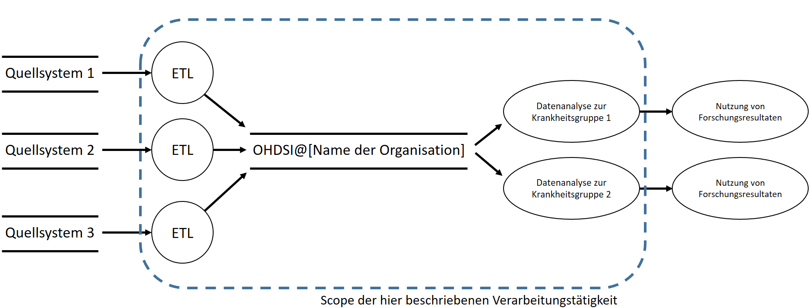
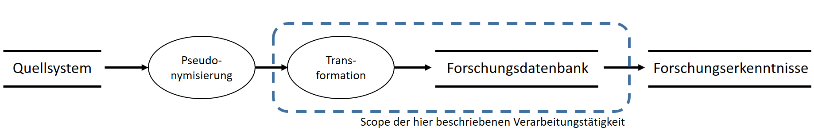

**Eintrag ins Verfahrensverzeichnis: OHDSI-Implementierung**

| Verantwortliche                   |                                 |
|-----------------------------------|---------------------------------|
| Fachliche(r) Verantwortliche(r):  | \[…\] |
| Technische(r) Verantwortliche(r): | \[…\] |

# Inhaltsverzeichnis

[1 Überblick und Zweck [2](#überblick-und-zweck)](#überblick-und-zweck)

[1.1 Zweck dieses Dokumentes
[2](#zweck-dieses-dokumentes)](#zweck-dieses-dokumentes)

[1.2 Überblick der Verarbeitungstätigkeit
[2](#überblick-der-verarbeitungstätigkeit)](#überblick-der-verarbeitungstätigkeit)

[1.3 Zweck der Verarbeitungstätigkeit
[3](#zweck-der-verarbeitungstätigkeit)](#zweck-der-verarbeitungstätigkeit)

[1.4 Geltungsbereich der Verarbeitungstätigkeit
[3](#geltungsbereich-der-verarbeitungstätigkeit)](#geltungsbereich-der-verarbeitungstätigkeit)

[1.5 Rahmendaten [4](#rahmendaten)](#rahmendaten)

[1.6 Beteiligte Personengruppen
[5](#beteiligte-personengruppen)](#beteiligte-personengruppen)

[1.7 Beteiligte Daten/Datenkategorie/Quelle/Rechtsgrundlage
[5](#beteiligte-datendatenkategoriequellerechtsgrundlage)](#beteiligte-datendatenkategoriequellerechtsgrundlage)

[1.8 Einwilligung [5](#einwilligung)](#einwilligung)

[2 Systematische Beschreibung der Verarbeitungstätigkeit
[5](#systematische-beschreibung-der-verarbeitungstätigkeit)](#systematische-beschreibung-der-verarbeitungstätigkeit)

[2.1 Grafische Darstellung der Verarbeitungstätigkeit
[5](#grafische-darstellung-der-verarbeitungstätigkeit)](#grafische-darstellung-der-verarbeitungstätigkeit)

[2.2 Beschreibung der Verarbeitungsschritte
[6](#beschreibung-der-verarbeitungsschritte)](#beschreibung-der-verarbeitungsschritte)

[2.2.1 Schritt 1: Transformation und Laden
[6](#schritt-1-transformation-und-laden)](#schritt-1-transformation-und-laden)

[2.2.2 Schritt 2: Nutzung der Analysetools
[6](#schritt-2-nutzung-der-analysetools)](#schritt-2-nutzung-der-analysetools)

[2.3 IT-Infrastruktur, Systeme und Anwendung sowie
Zugriffsberechtigungen
[6](#it-infrastruktur-systeme-und-anwendung-sowie-zugriffsberechtigungen)](#it-infrastruktur-systeme-und-anwendung-sowie-zugriffsberechtigungen)

[2.4 Datenfluss-Diagramm
[7](#datenfluss-diagramm)](#datenfluss-diagramm)

[3 Auftragsdatenverarbeitung
[7](#auftragsdatenverarbeitung)](#auftragsdatenverarbeitung)

[4 Datenübermittlung an Drittländer
[7](#datenübermittlung-an-drittländer)](#datenübermittlung-an-drittländer)

[5 Speicherung, Löschung und Weitergabe von Daten
[8](#speicherung-löschung-und-weitergabe-von-daten)](#speicherung-löschung-und-weitergabe-von-daten)

[5.1 Speicherort, Speicherdauer und Löschung der Daten
[8](#speicherort-speicherdauer-und-löschung-der-daten)](#speicherort-speicherdauer-und-löschung-der-daten)

[5.2 Empfänger der Daten
[8](#empfänger-der-daten)](#empfänger-der-daten)

[5.2.1 Empfänger innerhalb der Organisation
[8](#empfänger-innerhalb-der-organisation)](#empfänger-innerhalb-der-organisation)

[5.2.2 Empfänger außerhalb der Organisation
[9](#empfänger-außerhalb-der-organisation)](#empfänger-außerhalb-der-organisation)

[6 Wahrung der Betroffenenrechte
[9](#wahrung-der-betroffenenrechte)](#wahrung-der-betroffenenrechte)

[6.1 Information des Betroffenen (Art. 12 ff. DS-GVO)
[9](#information-des-betroffenen-art.-12-ff.-ds-gvo)](#information-des-betroffenen-art.-12-ff.-ds-gvo)

[6.2 Widerruf der Einwilligung (Art. 7 Abs. 3 DS-GVO)
[9](#widerruf-der-einwilligung-art.-7-abs.-3-ds-gvo)](#widerruf-der-einwilligung-art.-7-abs.-3-ds-gvo)

[6.3 Auskunftsrecht (Art. 15 DS-GVO)
[9](#auskunftsrecht-art.-15-ds-gvo)](#auskunftsrecht-art.-15-ds-gvo)

[6.4 Recht auf Berichtigung (Art. 16 DS-GVO)
[10](#recht-auf-berichtigung-art.-16-ds-gvo)](#recht-auf-berichtigung-art.-16-ds-gvo)

[6.5 Recht auf Löschung (Art. 17 DS-GVO)
[10](#recht-auf-löschung-art.-17-ds-gvo)](#recht-auf-löschung-art.-17-ds-gvo)

[6.6 Recht auf Einschränkung der Verarbeitung (Art. 18 DS-GVO)
[10](#recht-auf-einschränkung-der-verarbeitung-art.-18-ds-gvo)](#recht-auf-einschränkung-der-verarbeitung-art.-18-ds-gvo)

[6.7 Recht auf Datenübertragbarkeit (Art. 20 DS-GVO)
[10](#recht-auf-datenübertragbarkeit-art.-20-ds-gvo)](#recht-auf-datenübertragbarkeit-art.-20-ds-gvo)

[6.8 Widerspruchsrecht (Art. 21 DS-GVO)
[10](#widerspruchsrecht-art.-21-ds-gvo)](#widerspruchsrecht-art.-21-ds-gvo)

[7 Referenzen [10](#referenzen)](#referenzen)

# Anlagenverzeichnis

| Nr  | Titel                                                                                                                                                                                                                                   |
|-----|-----------------------------------------------------------------------------------------------------------------------------------------------------------------------------------------------------------------------------------------|
| A1  | Eintrag ins Verfahrensverzeichnis der Forschungsdatenbank OHDSI@\[Name der Organisation eintragen                                                                                                             |
| A2  | Leitlinie zur Informationssicherheit der Organisation \[Hier soll auf die entsprechenden allgemeine Regeln zur Informationssicherheit der Organisation verwiesen werden\].                                    |
| A3  | Zentrale technische und organisatorische Maßnahmen zur Gewährleistung des Datenschutzes. \[Hier soll auf die entsprechenden allgemeine Regeln zur Informationssicherheit der Organisation verwiesen werden\]. |
| A4  | Berechtigungskonzept der Forschungsdatenbank OHDSI@\[Name der Organisation eintragen\].                                                                                                                       |
| A5  | \[Falls zutreffend\] Auftragsdatenverarbeitungsverträge                                                                                                                                                       |

# Überblick und Zweck 

## Zweck dieses Dokumentes

Das vorliegende Dokument beschreibt alle Datenschutzrelevanten Aspekte
der Implementierung der unten beschriebenen Forschungsdatenbank in
\[*Name der Organisation*\] - im Folgenden
schlicht als „die Organisation“ bezeichnet.

## Überblick der Verarbeitungstätigkeit

Die Verarbeitungstätigkeit umfasst eine Gesundheitsdatenbank auf Basis
des Observational Medical Outcomes Partnership (OMOP) Common Data Model
(CDM) und der damit verbundenen Tools des Observational Health Data
Sciences and Informatics (OHDSI) Programms. Beim OMOP CDM handelt es
sich um ein international abgestimmtes Datenbankschema, in dem Daten aus
der Krankenversorgung und der medizinischen Forschung in strukturierter
und standardisierter Form abgelegt und so der medizinischen Forschung
über einfach zu bedienende graphische Werkzeuge (OHDSI-Tools) zugängig
gemacht werden können. Um eine weltweite Vergleichbarkeit der Daten zu
erreichen, werden diese außerdem mit einer Reihe gängiger
Interoperabilitätsstandards repräsentiert, u.a. Logical Observation
Identifiers Names and Codes (LOINC) sowie Systematized Nomenclature of
Medicine (SNOMED) Clinical Terms (CT).

Die Forschungsdatenbank ermöglicht grundsätzlich die Bearbeitung einer
Vielzahl von wissenschaftlichen Fragestellungen auf Basis
hochstandardisierter und qualitätsgesicherter Daten aus der
Krankenversorgung. Im praktischen Einsatz ist das Spektrum an
Anwendungsfällen natürlich durch die in der Datenbank abgebildeten Daten
bestimmt. Ein wichtiger Vorteil der Nutzbarmachung von
„Real-World-Daten“ liegt darin, dass im Unterschied zu reinen
Forschungsdaten ein deutlich größerer, heterogenerer (damit klinisch
valider) Datensatz für Auswertungen zur Verfügung steht. Weiterhin
ermöglicht die Standardisierung der Daten, sich im Rahmen großer
internationaler Initiativen und Projekte, wie OHDSI und EHDEN, an
umfangreichen, weltweit durchgeführten Real-World-Evidence Studien zu
beteiligen, wobei die Anonymität der in der Datenbank abgebildeten
Patientinnen und Patienten strikt gewahrt bleibt. Neben den genannten
Netzwerken werden die Technologien von OHDSI zunehmend auch in weiteren
Projekten eingesetzt und bspw. im Rahmen von EU-Förderungen als
Grundlage empfohlen (für mehr Details zur OHDSI-Methodik, Netzwerken und
Tools siehe \[1\]).

Ohne die Durchführung der in diesem Dokument beschriebenen
Verarbeitungstätigkeit ist die wissenschaftliche Sekundärnutzung von
Forschungsdaten nur eingeschränkt möglich. Insbesondere kann sich die
Organisation perspektivisch an großen Projekten und den internationalen
Real-World-Evidence-Netzwerken OHDSI und EHDEN nicht beteiligen. OHDSI
ist mit 160 Partneruniversitäten in 30 Ländern das größte
Real-World-Evidence-Netzwerk der Welt. Im Gegensatz zu einigen
kommerziellen Angeboten, die zunehmend auf den Markt drängen, ist es
offen und legt einen starken Wert auf Datenschutz. Weiterhin wird um
OHDSI herum eine lebendige Wissenschaftscommunity gepflegt, die in den
Jahren 2019-2020 ca. 80 technische und medizinische Publikationen
hervorgebracht hat. Die Organisation beraubt sich bei Nichtteilnahme
einer großen Chance und erleidet Wettbewerbsnachteile.

## Zweck der Verarbeitungstätigkeit

**Fachliche Tätigkeiten:** Die zu etablierende Forschungsdatenbank
bietet Forschenden der Organisation Funktionen zur wissenschaftlichen
Nutzung von pseudonymisierten Daten aus Krankenversorgung und Forschung.
Wichtige Funktionen umfassen: (1) Identifikation von
Datenqualitätsproblemen, (2) Möglichkeit zur Nutzung der OHDSI -Tools
zur Datenanalyse und Beantwortung verschiedener
Forschungsfragestellungen mittels gängiger statistischer Methoden (3)
Möglichkeit der Teilnahme an großen, internationalen
Forschungsprojekten, die große Datenbestände verteilt und unter
ausschließlichem Austausch von aggregierten Auswertungsergebnissen im
Sinne einer Meta-Analyse (d.h. Wahrung der Anonymität der Patientinnen
und Patienten) auswerten. Diese fachliche Tätigkeit finden auf
Projektbasis statt, so dass für jede Durchführung ein formales Projekt
\[Falls Ethikvotum notwendig: inklusive gesondertem
Ethikantrag\] definiert wird.

**Einordnung der Verarbeitungstätigkeit:** Die Verarbeitungstätigkeit
setzt eine Anbindung an die Gesundheitsdaten verarbeitende Quellsysteme
der Organisation voraus, die pseudonymisierte Daten für eine Nutzung in
OMOP/OHDSI bereitstellen. \[Hier kurz beschreiben,
wie die Verarbeitungstätigkeit im Kontext der IT der Organisation
einzuordnen ist, bspw. „die Verarbeitungstätigkeit setzt auf bereits
vorhandene Prozesse der vorhandenen IT-Zentralfunktion der Organisation
auf“ oder „für die Verarbeitungstätigkeit wurden eigens Prozesse
implementiert“, etc.\]

\[Hier kurz beschreiben, ob andere
Verarbeitungstätigkeiten der Organisation von der hier beschriebenen
Verarbeitungstätigkeit abhängt.\]

**Prozesseigner und -beteiligte:**

\[In diesem Abschnitt sind beteiligte Personen und
ihre Rollen zu beschreiben. Dazu gehören bspw.:

- Bereitsteller der technischen Infrastruktur und
  ihre Rollen.

- Für Betrieb und Wartung verantwortliche und ihre
  weiteren Rollen.

- Klinische Partner und ihre Rollen. Diese haben
  häufig die Hoheit über die Verwendung der Daten in der
  Forschungsdatenbank

- Auftragnehmer und ihre Rollen.\]

## Geltungsbereich der Verarbeitungstätigkeit

Vorausgehenden Verarbeitungstätigkeiten (VT): Die Erfassung von
medizinischen Daten im mittels einzelner Systeme der Organisation durch
entsprechendes Personal sowie die Pseudonymisierung und Bereitstellung
der Daten aus dem Quellsystem für die Forschungsdatenbank.

\[Hier ist in wenigen Sätzen zu nennen, wo die
Forschungsdatenbank betrieben wird. Dies kann bspw. im internen Netzwerk
der Organisation, in einer demilitarisierten Zone, im offenen Netz oder
auf dedizierter Hardware sein. Ein Verweis auf die entsprechend
festgelegten technischen und organisatorischen Maßnahmen dieser
Infrastruktur sollte ergänzt und in den Anhang aufgenommen
werden.\] Basierend auf einer Instanz des relationalen
Datenbankmanagementsystems \[Hier
Datenbankmanagementsystems, z.B. PostgreSQL\] werden verschieden
Funktionalitäten durch verschiedene weitere open-source Werkzeuge
bereitgestellt:

- ATLAS ist ein webbasiertes Tool, das von der OHDSI-Gemeinschaft
  entwickelt wurde und das Design und die Durchführung von
  wissenschaftlichen Analysen ermöglicht.

- HADES ist eine Sammlung von R-Paketen, die Funktionen bieten, die
  zusammen verwendet werden können, um eine vollständige
  Beobachtungsstudie, ausgehend von Daten im OMOP CDM, durchzuführen und
  Schätzungen und unterstützende Statistiken, Abbildungen und Tabellen
  zu erstellen.

- DATA QUALITY DASHBOARD verwendet eine harmonisierte Terminologie zur
  Bewertung der Qualität der Daten, die im OMOP CDM vorliegen.

- ACHILLES ist ein Software-Tool, das die Charakterisierung und
  Visualisierung einer CDM-konformen Datenbank ermöglicht.

> Zur Administration und Beladung der Datenbank kommen weitere Werkzeuge
> zum Einsatz:

- ATHENA ermöglicht sowohl die Suche als auch das Laden von
  standardisierten Vokabularen.

- WHITERABBIT und RABBIT-IN-A-HAT sind Software-Tools, die bei der
  Vorbereitung von Ladeprozessen helfen.

- USAGI ist ein Tool, das den manuellen Prozess der Erstellung einer
  Standardisierungsregel für Daten unterstützt. Es kann auf der
  Grundlage der textlichen Ähnlichkeit zu Elementen von
  Standardterminologien Zuordnungsvorschläge machen.

Die Nutzung der Softwarelösungen erfolgt ausschließlich von Rechnern die
für die Verarbeitung von pseudonymisierten Forschungsdaten nach den
zentralen Vorgaben der Organisation zugelassen sind oder über
web-basierte Oberflächen mittels verschlüsselter Verbindungen (HTTPS
oder SSH).

**Anschließende Verarbeitungstätigkeiten (VT):** Im Anschluss an die
Nutzung der OHDSI-Plattform erfolgt die Dissemination der durchgeführten
Datenanalysen, bspw. in Form der Erstellung von Publikationen. Dieser
Prozess findet in der Verantwortung der Forschenden statt und kann bspw.
die Nutzung der Forschungsdienste der Organisation beinhalten,
Primärdaten gemäß *Good Scientific Practice* für 10 Jahre sicher zu
archivieren. Die Daten in der Forschungsdatenbank selbst werden nur
durch den Standard-Backup-Mechanismus der Betriebsumgebung der
Forschungsdatenbank durch die \[Verantwortliche
Funktion für ein zentrales Backup in der entsprechenden Betriebsumgebung
der Forschungsdatenbank nennen, bspw. IT-Zentralfunktion\]
gesichert. Für den Gesamtdatenbestand findet darüber hinaus keine
Archivierung statt. Bei der Durchführung einzelner Forschungsvorhaben
durch Forschende liegt die Verantwortung für die Archivierung der in der
Studie genutzten Daten bei den Forschenden selbst und muss u.a. im
Studienprotokoll \[Falls Ethikvotum notwendig: bzw.
im Ethikantrag\] beschrieben werden. Es gelten also alle
Standardanforderungen der Organisation und es stehen die üblichen
Dienste für die Durchführung entsprechender Studien zur Verfügung.

## Rahmendaten

| Anzahl der an der Erstellung der Datenbank beteiligten Personen:       | Ca. \[…\] |
|------------------------------------------------------------------------|-------------------------------------|
| Anzahl der an der Administration der Datenbank beteiligten Personen:   | Ca. \[…\] |
| Anzahl der Personen, die die Datenbank zu Forschungszwecken nutzen     | Ca. \[…\] |
| Anzahl der betroffenen Patientinnen und Patienten/Personen/Fallzahlen: | Ca. \[…\] |

## Beteiligte Personengruppen

\[Hier wird den jeweiligen beteiligten
Personengruppen die entsprechenden Rollen in der Verarbeitungstätigkeit
zugeordnet. Die „Rolle in der Verarbeitungstätigkeit“ beschreibt dabei,
welche Art von Aufgaben hier aufgeführt werden sollen.\]

| Nr.                             | Bezeichnung der Personengruppe                 | Rolle in der Verarbeitungstätigkeit                                          |
|---------------------------------|------------------------------------------------|------------------------------------------------------------------------------|
| 1     | \[Personengruppe 1\] | \[z.B. Systemdesign, Datenpflege\]                 |
| 2     | \[Personengruppe 2\] | \[z.B. Datenanalyse, Berichterstattung\]           |
| 3     | \[Personengruppe 3\] | \[z.B. Zugriffsverwaltung, Administration\]        |
| 4     | \[Personengruppe 4\] | \[z.B. Datenbereitstellung, Teilnahme an Studien\] |
| \[…\] | \[…\]                | \[…\]                                              |

## Beteiligte Daten/Datenkategorie/Quelle/Rechtsgrundlage

Im Rahmen des Projektes werden relevante Daten aus
\[hier relevante Systeme aufzuzählen, bspw.
Krankenhausinformationssystem, Register, etc.\] extrahiert, in
die Struktur von OMOP/OHDSI überführt und in der Forschungsdatenbank
abgelegt werden. Es erfolgt ausschließlich eine Sekundärnutzung von
bereits im Rahmen der Krankenversorgung erfassten Daten. Im Folgenden
werden die Datenkategorien umfassend erläutert.

\[Im Folgenden sollen die Datenkategorien umfassend
erläutert werden. Jede Kategorie erfordert eine präzise Beschreibung
ihrer Inhalte, wobei konkrete Beispiele die Anschaulichkeit und das
Verständnis verbessern. Es ist entscheidend, die Herkunft der Daten
exakt zu benennen, sei es aus internen Systemen der Patientenverwaltung
oder externen Quellen wie Datenbanken öffentlicher Einrichtungen.
Abschließend muss die rechtliche Grundlage für den Umgang mit diesen
Daten dargelegt werden, um Konformität mit geltenden Datenschutzvorgaben
sicherzustellen.\]

1.  \[Datenkategorie 1\]

    1.  \[Beschreibung/Details/Spezifikation/Beispiele\]

    2.  \[Quellsystem\]

    3.  \[Rechtgrundlage der Verarbeitung\]

2.  \[Datenkategorie 2\]

    1.  \[Beschreibung/Details/Spezifikation/Beispiele\]

    2.  \[Quellsystem\]

    3.  \[Rechtgrundlage\]

3.  \[…\]

## Einwilligung

\[Falls Rechtsgrundlage der Datenverarbeitung auf
Einwilligung basiert hier Details nennen\]

# Systematische Beschreibung der Verarbeitungstätigkeit

## Grafische Darstellung der Verarbeitungstätigkeit

\<\<\<Hier die Verarbeitungstätigkeit grafisch
skizzieren, bspw. ist die Darstellung mithilfe eines *LINDDUN Data Flow
Diagrams* zu empfehlen, nachfolgend ein grobes Beispiel: \>\>\>

Die Grafik illustriert, dass für jeden der Krankheitsgruppen ein
getrennter Verarbeitungsprozess stattfindet. Auch in der Nutzung der
Forschungsdatenbank findet eine Mandantentrennung statt, so dass
berechtigte Forschende nur Zugriff auf Daten jeweils einer
Krankheitsgruppe erhalten (näheres siehe die Anlage A4). Da die Schritte
für jeden der Verarbeitungsprozesse sich nur in Details wie
Beispielweise Transformationsregeln unterscheiden, werden sie im
Folgenden gemeinsam beschrieben.

## Beschreibung der Verarbeitungsschritte

### Schritt 1: Transformation und Laden

- **Beschreibung des Prozessschrittes:** Die pseudonymisierten Daten
  werden in das Schema des OMOP CDM transformiert und in die
  Forschungsdatenbank geladen.

- **Beteiligte Personengruppen:** Anfangs Entwickler. Anschließend
  automatisiert.

- **Beteiligte Systeme (Hardware, Software):** Quelle:
  \[Name des Quellsystems\], Übertragung über
  sicheres Netzlaufwerk, Senke: OHDSI Forschungsdatenbank.

- **Beteiligte Datenkategorien:** \[Hier Nummern der
  Datenkategorien aus 1.7 nennen\]

### Schritt 2: Nutzung der Analysetools

- **Beschreibung des Prozessschrittes:** Nutzung der pseudonymisierten
  Daten und OHDSI-Datenanalysetools (ATLAS, HADES, DATA QUALITY
  DASHBOARD, ACHILLES) zu Forschungszwecken.

- **Beteiligte Personengruppen:** Berechtigte Forschende.

- **Beteiligte Systeme (Hardware, Software):** Server mit Installation
  des oben genannten Datenbankmanagementsystems, sowie den OHDSI-Tools
  (ATLAS, HADES, DATA QUALITY DASHBOARD, ACHILLES) sowie Endgeräte der
  Forscherinnen und Forscher nach zentralen Vorgaben der Organisation.

- **Beteiligte Datenkategorien:** \[Hier Nummern der
  Datenkategorien aus 1.7 nennen\]

## IT-Infrastruktur, Systeme und Anwendung sowie Zugriffsberechtigungen

\[Hier relevante Hardware (z.B. Server) mit
jeweiligen zugriffberechtigten Personen(-gruppe) auflisten.\]

| Nr.                         | Hardware                                 | Zugriffsberechtigte (gem. 1.6 Beteiligte Personengruppen) |
|-----------------------------|------------------------------------------|-----------------------------------------------------------|
| 1 | \[Hardware 1\] |                                                           |
| 2 | \[Hardware 2\] |                                                           |
| 3 | \[Hardware 3\] |                                                           |

| Nr.                         | Software                                 | Zugriffsberechtigte (gem. 1.6 Beteiligte Personengruppen) |
|-----------------------------|------------------------------------------|-----------------------------------------------------------|
| 1 | \[Software 1\] |                                                           |
| 2 | \[Software 2\] |                                                           |
| 3 | \[Software 3\] |                                                           |

## Datenfluss-Diagramm

\<\<\<Hier den Datenfluss grafisch skizzieren, bspw.
ist die Darstellung mithilfe eines *LINDDUN Data Flow Diagrams* zu
empfehlen, nachfolgend ein grobes Beispiel: \>\>\>

# Auftragsdatenverarbeitung

\[ \] Nein (weiter mit Punkt 4)

\[ \] Ja (bitte sämtliche Auftragsdatenverarbeiter benennen/beschreiben)

\[Hier sind sämtliche Auftragsdatenverarbeiter
detailliert aufzulisten. Zu den relevanten Informationen gehören
beispielsweise neben der Bezeichnung/dem Firmennamen des
Auftragsdatenverarbeiter auch die Angabe des Speicherorts der Daten, der
Hintergrund/Zweck der Verarbeitung. Die Beschreibung kann in Form einer
Liste oder in tabellarischer Form erfolgen.\]

# Datenübermittlung an Drittländer

\[ \] Nein (weiter mit Punkt 5)

\[ \] Ja (bitte sämtliche Datenübermittlungen benennen/beschreiben)

\[Hier sind sämtliche Datenübermittlungen detailliert
aufzulisten. Zu den relevanten Informationen gehören beispielsweise
neben der Benennung des Drittlandes auch die Angabe der Datenkategorie
sowie eine Beschreibung, wie die Daten übermittelt werden. Die
Beschreibung kann in Form einer Liste oder in tabellarischer Form
erfolgen.\]

# Speicherung, Löschung und Weitergabe von Daten

## Speicherort, Speicherdauer und Löschung der Daten

\[Folgende Tabelleninhalten sind beispielhaft
angegeben\]

| Datenkategorie (gem. 1.7 Beteiligte Daten/Datenkategorie) | Angabe des Speicherorts                | Angabe der Speicherdauer und der entsprechenden Rechtsgrundlage | Beschreibung der Löschung                                              |
|-----------------------------------------------------------|----------------------------------------|-----------------------------------------------------------------|------------------------------------------------------------------------|
| \[Datenkategorie 1\]            | \[Server 1\] | \[gem. Projektdauer\]                 | \[regelmäßige automatische Löschung aus DB\] |
| \[Datenkategorie 2\]            | \[Server 2\] | \[gem. Projektdauer\]                 | \[regelmäßige automatische Löschung aus DB\] |
| \[Datenkategorie 3\]            | \[Server 3\] | \[gem. Projektdauer\]                 | \[regelmäßige manuelle Löschung aus DB\]     |

## Empfänger der Daten

### Empfänger innerhalb der Organisation

Nein (weiter mit Punkt 5.2.2)

Ja (bitte Tabelle ausfüllen)

\[Folgende Tabelleninhalten sind beispielhaft
angegeben\]

| Datenkategorie (gem. 1.7 Beteiligte Daten/Datenkategorie) | Angabe des Empfängers                     | Angabe des Zwecks und der entsprechenden Rechtsgrundlage |
|-----------------------------------------------------------|-------------------------------------------|----------------------------------------------------------|
| \[Datenkategorie 1\]            | \[Empfänger 1\] | \[Entwicklung, gem. § xy\]     |
| \[Datenkategorie 2\]            | \[Empfänger 2\] | \[Administration, gem. § xy\]  |

### Empfänger außerhalb der Organisation 

Nein (weiter mit Punkt 6)

Ja (bitte Tabelle ausfüllen)

| Datenkategorie (gem. 1.7 Beteiligte Daten/Datenkategorie) | Angabe des Empfängers                     | Angabe des Zwecks und der entsprechenden Rechtsgrundlage |
|-----------------------------------------------------------|-------------------------------------------|----------------------------------------------------------|
| \[Datenkategorie 1\]            | \[Empfänger 1\] | \[Entwicklung, gem. § xy\]     |
| \[Datenkategorie 2\]            | \[Empfänger 2\] | \[Administration, gem. § xy\]  |

# Wahrung der Betroffenenrechte

\[Hier beschreiben, wie Patientinnen und Patienten
ihre Betroffenenrechte geltend machen können, bspw. Verweis auf
Richtlinien und Informationsquellen und/oder verantwortliche Rollen,
Ansprechpartner etc.\]. Die Umsetzung der Betroffenenrechte ist
in der Forschungsdatenbank durch jeweils berechtigte Nutzende technisch
möglich. Zu beachten ist, dass sich alle Änderungen in den Quellsystemen
durch die Synchronisation automatisch in den Daten in der
Forschungsdatenbank wiederspiegeln. Nur in der Forschungsdatenbank
gelöschte Einträge werden mit einem Flag auf Basis des Pseudonyms
versehen, so dass diese nicht erneut geladen werden.

## Information des Betroffenen (Art. 12 ff. DS-GVO)

\[Hier sollte beschrieben werden, wie die
Organisation Patientinnen und Patienten über die Verarbeitung ihrer
personenbezogenen Daten informiert. Es kann beispielsweise auf
Informationsbroschüren, Aufklärungsgespräche oder Datenschutzerklärungen
verwiesen werden. Nachfolgend ein Beispiel.\]

Die Patientinnen und Patienten werden im Rahmen der
Patienteninformationen zur stationären und ambulanten Behandlung über
retrospektive Studien der Organisation informiert.

## Widerruf der Einwilligung (Art. 7 Abs. 3 DS-GVO)

\[In diesem Abschnitt ist darzulegen, wie Betroffene
ihre Einwilligung zur Datenverarbeitung widerrufen können. Wenn die
Datenverarbeitung nicht auf Einwilligung beruht, sollte dies klar
dargestellt und die zugrunde liegende rechtliche Basis erläutert werden.
Andernfalls sollten die Schritte zum Widerruf der Einwilligung sowie die
Konsequenzen dieses Widerrufs klar und verständlich beschrieben werden.
Nachfolgend je ein Beispiel.\]

Beispiel 1: Nicht zutreffend, da die Datenverarbeitung auf Basis einer
gesetzlichen Grundlage erfolgt (s.o.).

Beispiel 2: Der Betroffene kann seine Einwilligung zur Datenverarbeitung
gemäß Art. 7 Abs. 3 DS-GVO jederzeit widerrufen. Dies berührt nicht die
Rechtmäßigkeit der Verarbeitung bis zum Widerruf. Zum Widerrufen muss
der Betroffene eine formlose Mitteilung per E-Mail oder Post an uns
senden. Die notwendigen Kontaktdaten sind \[z.B. auf
unserer Webseite im Impressum\] zu finden. Nach Eingang des
Widerrufs wird die Verarbeitung der Daten, die auf der Einwilligung
beruht, umgehend eingestellt.

## Auskunftsrecht (Art. 15 DS-GVO)

\[Es sollte beschrieben werden, wie Betroffene ihr
Recht auf Auskunft über die sie betreffenden personenbezogenen Daten
ausüben können, einschließlich der Kontaktdaten der zuständigen Stellen
(z.B. Datenschutzbeauftragter) und des Verfahrens zur Antragstellung.
Nachfolgend ein Beispiel.\]

Im Fall eines Auskunftsersuchens können sich die Betroffenen direkt an
die behördliche Datenschutzbeauftragte wenden. Darüber hinaus steht u.a.
auch als Erstkontakt der Durchführungsverantwortliche zur Verfügung. Die
Auskunft wird je nach Betroffenenstatus über die behördliche
Datenschutzbeauftragte in Abstimmung mit dem
Durchführungsverantwortlichen innerhalb der gesetzlich vorgeschrieben
Frist erteilt.

## Recht auf Berichtigung (Art. 16 DS-GVO)

\[Dieser Punkt sollte erläutern, wie Betroffene die
Berichtigung unrichtiger Daten beantragen können, sowie die Prozesse,
die die Organisation zur Sicherstellung der Richtigkeit der Daten
etabliert hat. Es könnte unter anderem beispielsweise beschrieben
werden, wie Fehler in den Daten korrigiert werden können, beispielsweise
durch ein internes Antragsverfahren oder automatische Systeme zur
Datenaktualisierung. Nachfolgend ein Beispiel.\]

Berichtigungen in den Quellsystemen ändern über die Synchronisation
automatisch die Daten in der Forschungsdatenbank.

## Recht auf Löschung (Art. 17 DS-GVO)

\[Hier wird erwartet, dass die Umstände, unter denen
Betroffene die Löschung ihrer Daten beantragen können, sowie die
Prozesse der Organisation zur Löschung der Daten, einschließlich
etwaiger Aufbewahrungsfristen, dargelegt werden. Nachfolgend ein
Beispiel.\]

Eine Löschung von personenbezogenen Daten der behandelten Person muss
unter anderem dann erfolgen, wenn die Daten nicht mehr notwendig sind
(Zweckwegfall), die Daten unrechtmäßig verarbeitet wurden, eine
Einwilligung widerrufen oder der Verarbeitung berechtigterweise
widersprochen wurde. In alle diesen Fällen gilt, dass Löschungen in den
Quellsystemen über die Synchronisation automatisch die Daten in der
Forschungsdatenbank löschen. Es gelten die in Kapitel 4.1 genannten
Aufbewahrungsfristen.

## Recht auf Einschränkung der Verarbeitung (Art. 18 DS-GVO)

\[In diesem Abschnitt sollte beschrieben werden, ob
und wie Betroffene eine Einschränkung der Verarbeitung ihrer Daten
beantragen können und unter welchen Bedingungen dies möglich ist.
Nachfolgend ein Beispiel.\]

Die betroffenen Personen haben jederzeit die Möglichkeit, die
Einschränkung der Verarbeitung ihrer Daten im Einzelfall zu verlangen.
Soweit der Antrag begründet ist und sich ausschließlich auf die
Forschungsdatenbank bezieht, wird die Einschränkung durchgeführt. Im
Falle einer Einschränkung in den Quellsystemen wirkt diese sich über die
Synchronisation automatisch auf die Daten in der Forschungsdatenbank
aus.

## Recht auf Datenübertragbarkeit (Art. 20 DS-GVO)

\[Dieser Teil sollte darlegen, wie Betroffene ihr
Recht auf Übertragung ausüben können, einschließlich der Verfahren zur
Anforderung und Bereitstellung dieser Daten. Nachfolgend ein
Beispiel.\]

Im Fall eines berechtigten Herausgabeverlangens können die zu einer
Person verarbeiteten Daten gedruckt und als formales Schreiben
bereitgestellt werden. Ebenso ist eine technische Übermittlung von Daten
möglich. Zu beachten ist, dass die Daten zwar in einem anderen
technischen Format vorliegen, semantisch jedoch mit den Daten in den
Quellsystemen übereinstimmen, so dass diese auch als Quelle für eine
Übertragung der Daten genutzt werden können.

## Widerspruchsrecht (Art. 21 DS-GVO)

\[Hier sollte erläutert werden, ob und wenn ja, wie
Betroffene Widerspruch gegen die Verarbeitung ihrer Daten einlegen
können, einschließlich der Bedingungen, unter denen ein solcher
Widerspruch möglich ist, und der Schritte, die die Organisation in
Reaktion darauf unternimmt. Nachfolgend ein Beispiel.\]

Da die personenbezogenen Daten auf Basis einer gesetzlichen
Rechtsgrundlage verarbeitet wurden, haben Betroffene das Recht zum
Widerspruch. Dies kann zur Löschung in den Quellsystemen oder
ausschließlich in der Forschungsdatenbank erfolgen (siehe auch
Löschung).

# Referenzen

\[1\] Observational Health Data Sciences and Informatics, The Book of
OHDSI, 2020.
