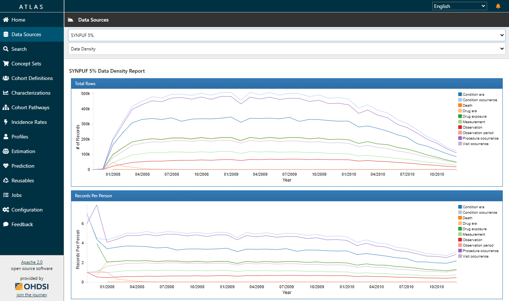

# Verfahrensbeschreibung: OHDSI-Forschungsdatenbank

- **Verantwortlicher:** [Name]
- **Autor:** [Name]
- **Datum:** [TT.MM.YYYY]
- **Version:** [1.0]

## Inhalt

1. Überblick
   * 1.1 Zweck des Verfahrens
   * 1.2 Technische, organisatorische und personelle Komponenten
   * 1.3 Daten, Quellen und Rechtsgrundlagen
2. Systematische Beschreibung
   * 2.1 System- und Softwarekomponenten
   * 2.2 Prozesse
     * 2.2.1 Prozess 1: Transformation und Laden
     * 2.2.2 Prozess 2: Nutzung der Analysetools
   * 2.3 Speicherung, Löschung und Zugriff
3. Wahrung von Betroffenenrechten
   * 3.1 Information der Betroffenen
   * 3.2 Widerruf der Einwilligung
   * 3.3 Auskunft
   * 3.4 Berichtigung
   * 3.5 Löschung
   * 3.6 Einschränkung der Verarbeitung
   * 3.7 Datenübertragung
   * 3.8 Widerspruch
4. Referenzen

## 1 Überblick 

Dieses Dokument beschreibt das Setup der Forschungsdatenbank auf Basis des Observational Medical Outcomes Partnership (OMOP) Common Data Model (CDM) und der damit verbundenen Tools der Observational Health Data Sciences and Informatics (OHDSI) Initiative. Beim OMOP CDM handelt es sich um ein international abgestimmtes Datenbankschema, in dem Daten aus der Krankenversorgung und der medizinischen Forschung in strukturierter und standardisierter Form abgelegt und so der medizinischen Forschung über einfach zu bedienende graphische Werkzeuge zugängig gemacht werden können. Um eine einrichtungsübergreifende Vergleichbarkeit der Daten zu erreichen, ist neben der Struktur auch die Semantik mittels gängiger Terminologiestandards, wie Logical Observation Identifiers Names and Codes (LOINC) oder der Systematized Nomenclature of Medicine (SNOMED) Clinical Terms (CT), vereinheitlicht.

Die Forschungsdatenbank ermöglicht grundsätzlich die Bearbeitung einer Vielzahl von wissenschaftlichen Fragestellungen auf Basis standardisierter und qualitätsgesicherter Daten. Im praktischen Einsatz ist das Spektrum an möglichen Anwendungsfällen durch die in der Datenbank abgebildeten Daten bestimmt. Ein wichtiger Vorteil der Nutzbarmachung von „Real-World-Daten“ liegt darin, dass im Unterschied zu reinen Forschungsdaten ein deutlich größerer, heterogenerer und damit klinisch validerer Datensatz für Auswertungen zur Verfügung steht. Weiterhin ermöglicht die Standardisierung der Daten, sich im Rahmen großer internationaler Initiativen wie OHDSI an einrichtungsübergreifend durchgeführten Studien zu beteiligen. Dabei werden Daten lokal ausgewertet und nur nicht-personenbezogene Analyseergebnisse ausgetauscht [1].

### 1.1 Zweck des Verfahrens

Die Forschungsdatenbank bietet Forschenden der Organisation Funktionen zur wissenschaftlichen Nutzung von pseudonymisierten Daten aus der Krankenversorgung und Forschung. Wichtige Funktionen umfassen: (1) Identifikation von Datenqualitätsproblemen, (2) Möglichkeit zur Nutzung der OHDSI -Tools zur Datenanalyse und Beantwortung verschiedener Forschungsfragestellungen mittels gängiger statistischer Methoden, (3) Möglichkeit der Teilnahme an großen, internationalen Forschungsprojekten, die unter ausschließlichem Austausch von aggregierten Auswertungsergebnissen im Sinne einer Meta-Analyse durchgeführt werden. Dabei wird die Anonymität der Betroffenen gewahrt.

Wissenschaftliche Auswertungen finden im Regelfall auf Projektbasis statt, die entsprechend formal definiert ist.

[_Hinweis: Hier können lokale Spezifika, wie beispielsweise die Notwendigkeit von Ethikvoten oder Studienprotokollen ergänzt werden_]

### 1.2 Technische, organisatorische und personelle Komponenten

Die Erfassung von medizinischen Daten findet mittels entsprechender Systeme und entsprechendem Personal außerhalb des Kontextes der OHDSI-Forschungsdatenbank statt. Dies gilt auch für die Integration und Pseudonymisierung der genutzten Daten, die durch eine Datenintegrationsplattform der Organisation erfolgt.

[_Hinweis: Falls dies anders gelöst ist, hier beschreiben_]

Die OHDSI-Forschungsdatenbank besteht im wesentlichen aus den folgenden Komponenten:
- Eine PostgreSQL-Datenbank mit dem OMOP CDM zur Speicherung der pseudonymisierten medizinischen Daten.
- Eine weitere PostgreSQL-Datenbank zur Speicherung von Konfigurationsoptionen und Studiendesigns.
- Apache SOLR für die Suche in den verfügbaren Vokabularien.
- OpenLDAP für die Authentifizierung und Autorisierung.

Basierend auf dieser Basisinfrastruktur werden die folgenden Anwendungen bereitgestellt:
- WebAPI ist eine RESTful API für den Zugriff auf und die Analyse von Daten, die im OMOP CDM gespeichert sind.
- ATLAS (siehe Screenshot) ist ein webbasiertes Werkzeug für die Durchführung wissenschaftlicher Auswertungen. 
- ARES ist ein System für die Charakterisierung und Qualitätsbewertung der Daten.
- RStudio für die Analyse der Daten unter Verwendung der Statistikprogrammiersprache R.

Alle genannten Komponenten werden auf einer virtuellen Maschine im stark geschützten Intranet der Organisation betrieben. Die Nutzung der Softwarelösungen erfolgt ausschließlich von Rechnern die für die Verarbeitung von pseudonymisierten Forschungsdaten nach den zentralen Vorgaben der Organisation zugelassen sind und über verschlüsselte Verbindungen (HTTPS oder SSH).

[_Hinweis: Der vorhergehenden Absatz kann entsprechend angepasst werden. Alternativ kann die Forschungsdatenbank auch in einer demilitarisierten Zone oder einem Forschungsnetz betrieben werden sowie dedizierte Hardware nutzen. Auch die technischen Zugriffsmöglichkeiten können anders geregelt sein. Es wird empfohlen, einen Verweis auf die entsprechend festgelegten technischen und organisatorischen Schutzmaßnahmen dieser Infrastrukturbereiche aufzunehmen. Möglicherweise kommen auch Alternativlösungen, beispielsweise statt PostgreSQL, zum Einsatz, was dann entsprechende Anpassungen erfordert._] 

Im Anschluss an die Nutzung der OHDSI-Tools erfolgt die Dissemination der durchgeführten Analysen, beispielsweise in Form der Erstellung von Publikationen. Dieser Prozess findet in der Verantwortung der Forschenden statt und kann beispielsweise die Nutzung der Forschungsdienste der Organisation zur Archivierung von Primärdaten beinhalten. Die Daten in der Forschungsdatenbank selbst werden durch den Standard-Backup-Mechanismus der Betriebsumgebung der Forschungsdatenbank gesichert. Es gelten also alle Standardanforderungen der Organisation und es stehen die üblichen Dienste für die Durchführung entsprechender Studien zur Verfügung.

[_Hinweis: Spezifika, beispielsweise zum Verantwortlichen für die genutzte Infrastruktur, beschreiben und Abweichungen, beispielsweise bezüglich Archivierung ergänzen_]

Folgende Personengruppen sind am Aufbau, dem Betrieb und der Nutzung der Forschungsdatenbank beteiligt. Personengruppen die Komponenten außerhalb des Geltungsbereichs der Forschungsdatenbank betreiben, also beispielsweise Basisinfrastruktur oder Quellsysteme, sind hier nicht aufgelistet.

| Personengruppe             | Aufgaben                                                                     |
|----------------------------|------------------------------------------------------------------------------|
| Technische Administrierende | Aufbau und Betrieb der Maschinen, Softwarekomponenten und ETL-Prozesse      |
| Fachliche Administrierende  | Qualitätsprüfungen, Bereitstellung und Wartung von Zugängen der Forschenden |
| Forschende                 | Nutzung der OHDSI-Tools zur Durchführung von Forschungsprojekten             |

[_Hinweis: Die genannten Personengruppen können entsprechend der lokalen Gegebenheiten angepasst werden. Beispielsweise ist es möglich, dass die fachliche Administration auch durch die technische Administration abgedeckt wird, oder dass separate Rollen für ETL-Prozesse sowie Auftragsdatenverarbeiter vorgesehen sind._]

### 1.3 Daten, Quellen und Rechtsgrundlagen

In der OHDSI-Forschungsdatenbank werden verschiedene Datenarten sekundär für Forschungszwecke genutzt. Dazu kommen weitere Daten im Rahmen des Betriebs, wie beispielsweise Nutzerkonten. Die folgende Tabelle bietet eine Übersicht über die genutzten Datenarten, ihre Quellsysteme und die Rechtsgrundlagen für die Verarbeitung.

| Datenart     | Quelle                           | Rechtsgrundlage |
|--------------|----------------------------------|-----------------|
| Demographie  | Krankenhausinformationssystem    | Einwilligung    |
| Diagnosen    | Krankenhausinformationssystem    | Einwilligung    |
| Prozeduren   | Krankenhausinformationssystem    | Einwilligung    |
| Labordaten   | Laborinformationssystem          | Einwilligung    |
| Nutzerkonten | Zentrale Nutzerverwaltung        | Arbeitsvertrag  |

[_Hinweis: Die Tabelle ist entsprechend der in der jeweiligen Installation genutzten Datenarten, Datenquellen und Rechtsgrundlagen anzupassen. Wenn die OHDSI-Forschungsdatenbank in einem Multi-Tenancy-Modus betrieben wird, können unterschiedliche Datenarten unterschiedlichen Forschenden zugängig gemacht werden. Dies kann im folgenden Abschnitt genauer beschrieben werden. Statt der generischen Nennung von "Einwilligung" oder anderen Rechtsgrundlagen sollten diese konkret benannt werden. Dazu können beispielsweise auch Unterabschnitte oder Anhänge genutzt werden._]

## 2 Systematische Beschreibung

### 2.1 System- und Softwarekomponenten

In diesem Abschnitt werden die genutzten System- und Softwarekomponenten tabellarisch aufgeführt. Dabei werden Zugriffsberechtigungen anhand der im vorherigen Abschnitt beschriebenen Personengruppen definiert.

| Systemkomponente   | Zugriffsberechtigte Personengruppe |
|--------------------|------------------------------------|
| Virtuelle Maschine | Technische Administrierende        |

| Softwarekomponente   | Zugriffsberechtigte Personengruppe                      |
|----------------------|---------------------------------------------------------|
| Betriebssystem       | Technische Administrierende                             |
| ETL-Tool             | Technische Administrierende                             |
| PostgreSQL-Datenbank | Technische Administrierende                             |
| Apache SOLR          | Technische Administrierende                             |
| OpenLDAP             | Technische Administrierende, Fachliche Administrierende |
| WebAPI               | Fachliche Administrierende, Forschende                  |
| ATLAS                | Fachliche Administrierende, Forschende                  |
| ARES                 | Fachliche Administrierende, Forschende                  |
| RStudio              | Fachliche Administrierende, Forschende                  |

[_Hinweis: Die Tabelle ist entsprechend der in der jeweiligen lokalen Spezifika anzupassen. Insbesondere macht OHDSI keine Vorgaben zur Implementierung des ETL-Prozesses, weshalb der Eintrag "ETL-Tool" angepasst werden muss._]

### 2.2 Prozesse

Eine strukturierte Beschreibung der relevanten Systemkomponenten sowie Datenflüsse ist im Folgenden mittels eines LINDDUN Data Flow Diagrams [2] dargestellt:

[_Hinweis: Das Diagramm ist an die lokalen Gegebenheiten anzupassen. Ein LINDDUN-Diagramm ist eine spezialisierte Form eines Datenflussdiagramms, das speziell für die Analyse und Visualisierung von Datenschutzrisiken in Softwarearchitekturen entwickelt wurde. Eine Einführung und eine Beschreibung der Syntax findet sich in [2]._]

Der Geltungsbereich dieses Dokumentes ist in der Grafik angegeben und umfasst die ETL-Prozesse sowie die Nutzung der Daten und Tools. Da sich die Schritte für jeden der Verarbeitungsprozesse nur in Details, wie beispielsweise Transformationsregeln, unterscheiden, werden sie im Folgenden gemeinsam beschrieben.

#### 2.2.1 Prozess 1: Transformation und Laden

- **Beschreibung des Prozesses:** Pseudonymisierte Daten werden in die Struktur des OMOP CDM transformiert und mit entsprechenden Terminologiecodes abgebildet. Anschließend werden sie in die Datenbank geladen.

- **Beteiligte Personengruppen:** Technische Administrierende.

- **Beteiligte Komponenten:** Virtuelle Maschine, Betriebssystem, ETL-Tool, PostgreSQL-Datenbank.

- **Beteiligte Datenkategorien:** Demographie, Diagnosen, Prozeduren, Labordaten.

#### 2.2.2 Prozess 2: Nutzung der Analysetools

- **Beschreibung des Prozessschrittes:** Qualitätsbewertung und Auswertung der pseudonymisierten Daten mittels ARES, ATLAS und RStudio.

- **Beteiligte Personengruppen:** Forschende.

- **Beteiligte Komponenten:** ARES, ATLAS und RStudio.

- **Beteiligte Datenkategorien:** Projektabhängig.

[_Hinweis: Die Prozessübersicht ist an die lokalen Gegebenheiten, sowie Komponenten, Datenarten und Personengruppen anzupassen._]

[_Hinweis: Im Falle einer Auftragsdatenverarbeitung wird empfohlen, diese hier detailliert aufzulisten und auf die entsprechenden Verträge zu verweisen. Gängige Dienstleistungen im Kontext von OHDSI umfassen den Betrieb der Infrastruktur oder Datenbank, sowie die Implementierung von ETL-Prozessen_.]

### 2.3 Speicherung, Löschung und Zugriff

| Datenkategorie | Speicherort | Speicherdauer                          | Zugriff                                                             |
|----------------|-------------|----------------------------------------|---------------------------------------------------------------------|
| Demographie    | PostgreSQL  | Gemäß lokaler Regularien               | Technische Administrierende, Fachliche Administrierende, Forschende |
| Diagnosen      | PostgreSQL  | Gemäß lokaler Regularien               | Technische Administrierende, Fachliche Administrierende, Forschende |
| Prozeduren     | PostgreSQL  | Gemäß lokaler Regularien               | Technische Administrierende, Fachliche Administrierende, Forschende |
| Labordaten     | PostgreSQL  | Gemäß lokaler Regularien               | Technische Administrierende, Fachliche Administrierende, Forschende |
| Nutzerkonten   | OpenLDAP    | Bis Kündigung oder Ablauf des Accounts | Technische Administrierende, Fachliche Administrierende             |

[_Hinweis: Die Tabelle muss entsprechend lokaler Regularien in Bezug auf Speicherdauern und Zugriffe angepasst und ergänzt werden._]

## 3 Wahrung von Betroffenenrechten

[_Hinweis: Patienten haben in der Regel eine Reihe von Rechten bezüglich ihrer persönlichen Daten, die in unterschiedlichen rechtlichen Rahmenwerken verankert sind. Der vorliegende Abschnitt und die Unterabschnitte beziehen sich auf die EU Datenschutz-Grundverordnung und müssen entsprechend an lokale Gegebenheiten angepasst werden._]

Die Durchführung von Maßnahmen zur Umsetzung von Betroffenenrechte ist in der Forschungsdatenbank durch jeweils berechtigte Nutzende technisch möglich. Zu beachten ist, dass sich alle Änderungen in den Quellsystemen durch die Synchronisation automatisch in den Daten in der Forschungsdatenbank wiederspiegeln.

### 3.1 Information der Betroffenen

Die Patientinnen und Patienten werden im Rahmen der Einwilligung umfangreich über die OHDSI-Forschungsdatenbank aufgeklärt.

[_Hinweis: Hier sollte beschrieben werden, wie die Organisation Patientinnen und Patienten über die Verarbeitung ihrer personenbezogenen Daten informiert. Es kann beispielsweise auf Informationsbroschüren, Aufklärungsgespräche oder Datenschutzerklärungen verwiesen werden._]

### 3.2 Widerruf der Einwilligung

Die Betroffenen können ihre Einwilligung zur Datenverarbeitung jederzeit widerrufen. Dies berührt nicht die Rechtmäßigkeit der Verarbeitung bis zum Widerruf. Zum Widerrufen muss der Betroffene eine formlose Mitteilung per E-Mail oder Post an uns senden. Die notwendigen Kontaktdaten sind in der Einwilligungserklärung zu finden. Nach Eingang des Widerrufs werden diese nicht mehr durch die Datenintegrationsplattform an die OHDSI-Forschungsdatenbank geliefert.

[_Hinweis: In diesem Abschnitt ist darzulegen, wie Betroffene ihre Einwilligung zur Datenverarbeitung widerrufen können. Wenn die Datenverarbeitung nicht auf einer Einwilligung beruht, kann stattdessen die entsprechende Rechtsgrundlage genannt werden._]

### 3.3 Auskunft

Im Fall eines Auskunftsersuchens können sich die Betroffenen direkt an die behördliche Datenschutzbeauftragte wenden. Darüber hinaus steht u.a. auch als Erstkontakt die in der Einwilligung genannte Kontaktadresse zur Verfügung.

[_Hinweis: Es sollte beschrieben werden, wie Betroffene ihr Recht auf Auskunft ausüben können, einschließlich der Kontaktdaten der zuständigen Stellen._]

### 3.4 Berichtigung

Im Fall eines Berichtigungsersuchens können sich die Betroffenen direkt an die behördliche Datenschutzbeauftragte wenden. Berichtigungen in den Quellsystemen werden mittels der Synchronisation automatisch in die Forschungsdatenbank übernommen.

[_Hinweis: Dies ist an lokale Gegebenheiten anzupassen._]

### 3.5 Löschung

Im Fall eines Löschersuchens können sich die Betroffenen direkt an die behördliche Datenschutzbeauftragte oder die in der Einwilligung angegebenen Kontaktdaten wenden. Löschungen werden aus den Quellsystemen in die Forschungsdatenbank synchronisiert oder mittels Löschflag in der Datenbank umgesetzt.

[_Hinweis: Dies ist an lokale Gegebenheiten anzupassen._]

### 3.6 Einschränkung der Verarbeitung

Für eine Einschränkung der Verarbeitung können sich die Betroffenen direkt an die behördliche Datenschutzbeauftragte oder die in der Einwilligung angegebenen Kontaktdaten wenden. Soweit der Antrag begründet ist und sich ausschließlich auf die Forschungsdatenbank bezieht, wird die Einschränkung durchgeführt. Im Falle einer Einschränkung in den Quellsystemen wirkt diese sich über die Synchronisation automatisch auf die Daten in der Forschungsdatenbank aus.

[_Hinweis: Dies ist an lokale Gegebenheiten anzupassen._]

### 3.7 Datenübertragung

Im Fall eines berechtigten Herausgabeverlangens können die zu einer Person verarbeiteten Daten gedruckt und als formales Schreiben bereitgestellt werden. Ebenso ist eine technische Übermittlung von Daten möglich. Zu beachten ist, dass die Daten zwar in einem anderen technischen Format vorliegen, semantisch jedoch mit den Daten in den Quellsystemen übereinstimmen, so dass diese auch als Quelle für eine Übertragung der Daten genutzt werden können.

[_Hinweis: Dies ist an lokale Gegebenheiten anzupassen._]

### 3.8 Widerspruch

Da die personenbezogenen Daten auf Basis einer gesetzlichen Rechtsgrundlage verarbeitet wurden, haben Betroffene das Recht zum Widerspruch. Dies kann zur Löschung in den Quellsystemen oder ausschließlich in der Forschungsdatenbank erfolgen (siehe auch Löschung).

[_Hinweis: Dies ist an lokale Gegebenheiten anzupassen._]

## 4 Referenzen

[1] Observational Health Data Sciences and Informatics, The Book of OHDSI, 2020.

[2] Deng, M., Wuyts, K., Scandariato, R., Preneel, B., & Joosen, W. (2011). A privacy threat analysis framework: supporting the elicitation and fulfillment of privacy requirements. Requirements Engineering, 16(1), 3-32.

[3] Berechtigungskonzept der OHDSI-Forschungsdatenbank.
