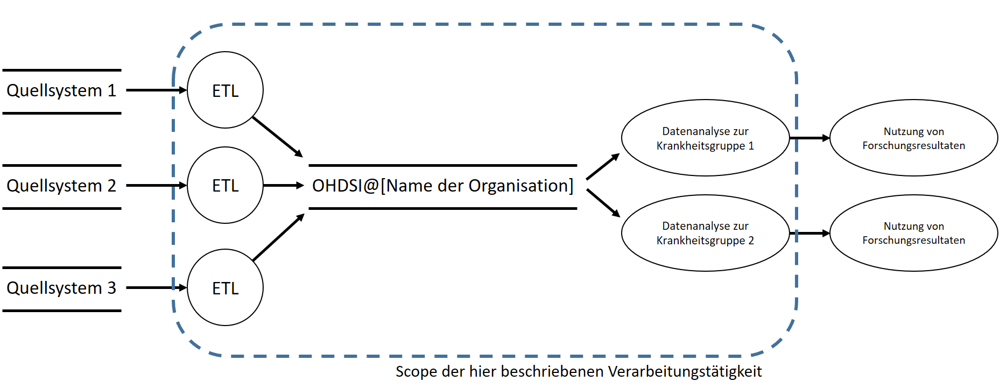

<H1> Informationssicherheitskonzept </H1>

| Verantwortliche                   |                                 |
|-----------------------------------|---------------------------------|
| Durchführungsverantwortliche(r):  | \[…\] |
| Fachliche(r) Verantwortliche(r):  | \[…\] |
| Technische(r) Verantwortliche(r): | \[…\] |
| Erstellung durch:                 | \[…\] |

| Berichtsversion: | \[…\]      |
|------------------|--------------------------------------|
| Stand:           | TT.MM.YYYY |

# Inhaltsverzeichnis

[1 Hintergrund [2](#hintergrund)](#hintergrund)

[2 Feststellung des Schutzbedarfs
[2](#feststellung-des-schutzbedarfs)](#feststellung-des-schutzbedarfs)

[2.1 Risikoanalyse für Prozess 1: Datentransformation und -laden
[4](#risikoanalyse-für-prozess-1-datentransformation-und--laden)](#risikoanalyse-für-prozess-1-datentransformation-und--laden)

[2.2 Risikoanalyse für Prozess 2: Datennutzung
[5](#risikoanalyse-für-prozess-2-datennutzung)](#risikoanalyse-für-prozess-2-datennutzung)

[2.3 Festgestellter Schutzbedarf
[5](#festgestellter-schutzbedarf)](#festgestellter-schutzbedarf)

[3 Strukturierung von Maßnahmen
[5](#strukturierung-von-maßnahmen)](#strukturierung-von-maßnahmen)

[3.1 Bausteine des BSI IT-Grundschutzes
[6](#bausteine-des-bsi-it-grundschutzes)](#bausteine-des-bsi-it-grundschutzes)

[3.2 Model 2: Ebenenmodell zur Sicherheitskonzeption von Webanwendungen
[6](#model-2-ebenenmodell-zur-sicherheitskonzeption-von-webanwendungen)](#model-2-ebenenmodell-zur-sicherheitskonzeption-von-webanwendungen)

[4 Zugangskontrolle [7](#zugangskontrolle)](#zugangskontrolle)

[5 Zutrittskontrolle [7](#zutrittskontrolle)](#zutrittskontrolle)

[6 Datenträgerkontrolle
[7](#datenträgerkontrolle)](#datenträgerkontrolle)

[7 Speicherkontrolle [7](#speicherkontrolle)](#speicherkontrolle)

[8 Benutzerkontrolle [7](#benutzerkontrolle)](#benutzerkontrolle)

[9 Zugriffskontrolle [8](#zugriffskontrolle)](#zugriffskontrolle)

[10 Übertragungskontrolle
[8](#übertragungskontrolle)](#übertragungskontrolle)

[11 Eingabekontrolle [8](#eingabekontrolle)](#eingabekontrolle)

[12 Transportkontrolle [8](#transportkontrolle)](#transportkontrolle)

[13 Wiederherstellbarkeit
[9](#wiederherstellbarkeit)](#wiederherstellbarkeit)

[14 Zuverlässigkeit [9](#zuverlässigkeit)](#zuverlässigkeit)

[15 Datenintegrität [9](#datenintegrität)](#datenintegrität)

[16 Auftragskontrolle [9](#auftragskontrolle)](#auftragskontrolle)

[17 Verfügbarkeitskontrolle
[10](#verfügbarkeitskontrolle)](#verfügbarkeitskontrolle)

[18 Trennbarkeit [10](#trennbarkeit)](#trennbarkeit)

[19 Referenzen [10](#referenzen)](#referenzen)

# Anlagenverzeichnis

| Nr  | Titel                                                                                                                                                                                                           |
|-----|-----------------------------------------------------------------------------------------------------------------------------------------------------------------------------------------------------------------|
| A1  | Eintrag ins Verfahrensverzeichnis der Forschungsdatenbank OHDSI@\[Name der Organisation eintragen                                                                                     |
| A2  | Leitlinie zur Informationssicherheit der Organisation \[Hier soll auf die entsprechenden allgemeine Regeln zur Informationssicherheit der Organisation verwiesen werden\].            |
| A3  | Zentrale technische und organisatorische Maßnahmen zur Gewährleistung des Datenschutzes. \[Hier soll auf die entsprechenden allgemeine Maßnahmen der Organisation verwiesen werden\]. |
| A4  | Betriebskonzept der Forschungsdatenbank OHDSI@\[Name der Organisation eintragen\].                                                                                                    |

\[**Bitte nehmen Sie sich die Zeit, alle dargelegten
Punkte sorgfältig zu lesen und passen Sie die Beschreibungen gemäß Ihren
individuellen Anforderungen an.\]**

# Hintergrund

Im Projekt OHDSI@\[Name der Organisation\]
wird eine Forschungsdatenbank erstellt, welche besondere Kategorien
personenbezogener Daten, nämlich Gesundheitsdaten, verarbeitet. Ziel
dieses Dokumentes ist es die technischen und organisatorischen Maßnahmen
zu beschreiben, die ergriffen wurden, um die Sicherheitsziele
Vertraulichkeit, Integrität sowie Verfügbarkeit in
\[Name der Organisation\] - im Folgenden
schlicht als „die Organisation“ bezeichnet - zu gewährleisten
\[Hier kann ein Verweis auf Anforderungen aus einer
unternehmensinternen Leitlinien/Richtlinie zur Aufrechterhaltung der
Informationssicherheit eingebaut werden\].

# Feststellung des Schutzbedarfs

\[In diesem Abschnitt soll eine Methodik für die
Risikoanalyse zur Feststellung des Schutzbedarfs und die Ermittlung
notwendiger Maßnahmen für die Implementierung von OHDSI in der
Organisation beschrieben werden. Hierfür kann ein individuell geeigneter
Ansatz gewählt werden. Auf internationaler Ebene existieren vereinzelt
Methoden, wobei eine universelle Eignung für alle Arten von
Organisationen nicht gewährleistet werden kann. Daher empfiehlt zunächst
sich zu prüfen, welche unternehmensinterne Methodik empfohlen oder
verpflichtend zu nutzen ist. Sollte Methodik keine vorliegen, kann eine
Methodik auch selbst definiert werden. Im Folgenden wird auf die
Risikobewertungs-Methodik der Agentur der Europäischen Union für
Cybersicherheit (ENISA) referenziert.\]

Bei der Durchführung der Risikoanalyse zur Feststellung des
Schutzbedarfs und notwendiger Maßnahmen für die Forschungsdatenbank
wurde weitgehend den Methoden der Agentur der Europäischen Union für
Cybersicherheit (ENISA) \[1\] sowie des IT-Grundschutzes des deutschen
Bundesamtes für Sicherheit in der Informationstechnik (BSI), d.h. der
Methodik des BSI-Standards 200-3, gefolgt \[2\]. Dies bedeutet u.a.,
dass Eintrittshäufigkeiten und Auswirkungsschweren der genannten
Gefährdungen zunächst einzeln und anschließend zusammenfassend bewertet
werden.

Zur Risikobewertung auf Basis von Eintrittshäufigkeiten und Auswirkungen
wird gemäß ENISA die in Tabelle 1 dargestellte 3x3-Risikomatrix genutzt.

|                                   |         | **Grad der Auswirkung** |                  |                |
|-----------------------------------|---------|-------------------------|------------------|----------------|
|                                   |         | Niedrig                 | Mittel           | Hoch/Sehr hoch |
| **Eintritts-wahrschein-lichkeit** | Niedrig | Geringes Risiko         | Mittleres Risiko | Hohes Risiko   |
|                                   | Mittel  | Geringes Risiko         | Mittleres Risiko | Hohes Risiko   |
|                                   | Hoch    | Mittleres Risiko        | Hohes Risiko     | Hohes Risiko   |

Tabelle 1: Matrix zur Risikobewertung

Bei den Auswirkungen kann es sich um technische (bspw. Verlust von
Verfügbarkeit von Systemen) und geschäftliche (bspw. Reputationsverlust)
Schäden handeln \[1\]. Zur Abschätzung der Eintrittswahrscheinlichkeit
müssen verschiedene Aspekte, wie die gegebenen Umstände, bisherige
organisations- oder unternehmensspezifische Erfahrungen, sowie
allgemeine Statistiken berücksichtigt werden \[1\].

\<\<\<Hier die Verarbeitungstätigkeit grafisch
skizzieren, bspw. ist die Darstellung mithilfe eines *LINDDUN Data Flow
Diagrams* zu empfehlen, nachfolgend ein grobes Beispiel: \>\>\>

Abbildung 1:Architekturübersicht und wesentliche fachliche Tätigkeiten.

Die Bewertung der Risiken wird auf Ebene der wesentlichen durch die
Lösung unterstützen fachlichen Tätigkeiten, wie in Abbildung 1
dargestellt, vorgenommen. \[Hier ist kurz zu
beschreiben, welche Daten in der Datenbank verarbeitet werden
sollen.\]. Da die Schritte für jeden der nach Krankheitsgruppen
getrennten Verarbeitungsprozesse sich nur in Details wie Beispielweise
Transformationsregeln unterscheiden, werden sie im Folgenden gemeinsam
beschrieben: (1) der Prozess der Datentransformation und des Datenladens
sowie (2) der Prozess der Datennutzung (siehe Eintrag ins
Verfahrensverzeichnis für die Forschungsdatenbank (siehe Anlage
\[Ax\]) für eine detaillierte Darstellung der
Prozesse).

Eckpunkte für die Risikoanalyse ergeben sich aus den zu betrachtenden
Gewährleistungszielen, Gefährdungen und Schutzmaßnahmen. Die
wesentlichen Ziele der Informationssicherheit sowie wesentliche
identifizierte Gefährdungen dieser Ziele sind in Tabelle 2 dargestellt.

| Gewährleistungsziel | Gefährdung                                |
|---------------------|-------------------------------------------|
| Vertraulichkeit     | Unrechtmäßiger Datenzugriff.              |
| Integrität          | Unerwünschte Datenänderung.               |
| Verfügbarkeit       | Datenverlust bzw. Ausfall der IT-Systeme. |

Tabelle 2: Relevante Gewährleistungsziele und Gefährdungen.

Zur Einschätzung der Auswirkungen einer Verletzung der Vertraulichkeit
der Daten wird der anzunehmende Schaden für die Rechte und Freiheiten
der Betroffenen auf Basis der von ENISA vorgeschlagenen Abstufung (vgl.
Tabelle 3) eingesetzt. Hintergrund ist die berechtigte Annahme, dass die
Auswirkungen auf die Organisation (bspw. durch Reputationsverlust) stark
mit den Auswirkungen auf die Privatsphäre der Betroffenen bzw. der
Sensibilität der unrechtmäßig offengelegten Daten korreliert.

| **Grad der Auswirkung** | **Beschreibung**                                                                                                                                                                                                                                                                                                |
|-------------------------|-----------------------------------------------------------------------------------------------------------------------------------------------------------------------------------------------------------------------------------------------------------------------------------------------------------------|
| Gering                  | Der Betroffene kann auf einige geringfügige Unannehmlichkeiten stoßen, die er ohne Probleme überwinden wird (Zeitaufwand für die erneute Eingabe von Informationen, Ärger, Irritationen usw.).                                                                                                                  |
| Mittel                  | Der Betroffene kann auf erhebliche Unannehmlichkeiten stoßen, die er trotz einiger Schwierigkeiten überwinden kann (zusätzliche Kosten, Verweigerung des Zugangs zu Unternehmensdienstleistungen, Angst, Unverständnis, Stress, kleinere körperliche Beschwerden usw.).                                         |
| Hoch                    | Der Betroffene kann mit schwerwiegenden Folgen konfrontiert werden, die er jedoch unter großen Schwierigkeiten überwinden kann (Veruntreuung von Geldern, schwarze Listen bei Finanzinstituten, Verlust des Eigentums, Verlust des Arbeitsplatzes, Vorladungen, Verschlechterung des Gesundheitszustands usw.). |
| Sehr hoch               | Der Betroffene kann mit schwerwiegenden oder sogar irreversiblen Folgen konfrontiert werden, die er nicht überwinden kann (Arbeitsunfähigkeit, lang anhaltende psychische oder physische Beschwerden, Tod usw.).                                                                                                |

Tabelle 3: Abstufung von Auswirkungen bei Verletzung der
Vertraulichkeit.

## Risikoanalyse für Prozess 1: Datentransformation und -laden

In diesem Prozess werden die bereits an der Quelle
(\[Name/Bezeichnung der Quelle/des
Quellsystems\]) pseudonymisierten Daten in das Schema des OMOP
Common Data Model (CDM) transformiert und in die Forschungsdatenbank
geladen.

- **Verfügbarkeit**: Eine Einschränkung der Verfügbarkeit der
  Forschungsdatenbank ist beispielsweise durch Wartungsarbeiten relativ
  häufig möglich. Geplant ist eine Mindesterreichbarkeit von Montag bis
  Freitag von \[xx:yy – xx:yy Uhr\]. Ein sich
  aus der Nicht-Verfügbarkeit der Datenbank oder der
  Datenübernahmeprozesse ergebender Schaden ist vernachlässigbar, da
  ausschließlich nicht-kritische Prozesse im Forschungskontext
  unterstützt werden. Dies führt unter Berücksichtigung von Tabelle 1 zu
  einem geringen Risiko.

- **Integrität**: Die Häufigkeit für eine Verletzung der Integrität der
  Daten ist als „mittel“ häufig einzuschätzen. Ein aus der Verletzung
  resultierender Schaden ist vernachlässigbar, da dieser sich maximal
  negativ auf die im Rahmen der Forschungsprozesse berechneten
  Statistiken auswirken kann. Dies führt unter Berücksichtigung von
  Tabelle 1 zu einem geringen Risiko.

- **Vertraulichkeit**: Die Häufigkeit für eine Verletzung der
  Vertraulichkeit der Daten ist aufgrund der strengen Zugangs- und
  Zugriffskontrolle und des beschränkten Nutzerkreises als selten
  einzuschätzen. Ein aus der Verletzung resultierender Schaden kann
  unter Einbezug von Tabelle 3 als begrenzt angenommen werden, da es
  sich um pseudonymisierte Daten handelt. Dies führt unter Einbezug von
  Tabelle 1 zu einem geringen Risiko.

Zusammenfassend ergibt sich die in Tabelle 4 dargestellte Bewertung der
Risiken im Kontext des Prozesses.

| Gewährleistungsziel | Eintrittshäufigkeit | Schaden          | Risiko          |
|---------------------|---------------------|------------------|-----------------|
| Vertraulichkeit     | Häufig              | Vernachlässigbar | Geringes Risiko |
| Integrität          | Mittel              | Vernachlässigbar | Geringes Risiko |
| Verfügbarkeit       | Selten              | Begrenzt         | Geringes Risiko |

Tabelle 4: Bewertung der aus Prozess 1 resultierenden Risiken.

## Risikoanalyse für Prozess 2: Datennutzung

> In diesem Prozess kommt es zur Nutzung der pseudonymisierten Daten und
> OHDSI-Datenanalysetools (ATLAS, HADES, DATA QUALITY DASHBOARD,
> ACHILLES) zu Forschungszwecken.

- **Verfügbarkeit:** Eine Einschränkung der Verfügbarkeit der
  Forschungsdatenbank ist beispielsweise durch Wartungsarbeiten relativ
  häufig möglich. Geplant ist eine Mindesterreichbarkeit von Montag bis
  Freitag von \[xx:yy – xx:yy Uhr\]. Ein sich
  aus der Nicht-Verfügbarkeit der Datenbank ergebender Schaden ist
  vernachlässigbar, da diese nur für ausgewählte Forschungszwecke
  genutzt wird. Dies führt unter Berücksichtigung von Tabelle 1 zu einem
  geringen Risiko.

- **Integrität:** Die Häufigkeit für eine Verletzung der Integrität der
  Daten ist als „mittel“ häufig einzuschätzen. Ein aus der Verletzung
  resultierender Schaden ist begrenzt, da dieser maximal zu falschen
  Ergebnissen in wissenschaftlichen Auswertungen führen würde, was bei
  der Sekundärnutzung von Daten aus der Krankenversorgung grundsätzlich
  nicht ausgeschlossen werden kann, da bereits die Quelldaten im
  Regelfall eine geringe Qualität aufweisen. Dies führt unter Einbezug
  von Tabelle 1 zu einem geringen Risiko.

- **Vertraulichkeit:** Die Häufigkeit für eine Verletzung der
  Vertraulichkeit der Daten ist aufgrund der strengen Zugangs- und
  Zugriffskontrolle und des beschränkten Nutzerkreises als selten
  einzuschätzen. Ein aus der Verletzung resultierender Schaden kann
  unter Einbezug von Tabelle 3 als begrenzt angenommen werden, da es
  sich um pseudonymisierte Daten handelt. Dies führt unter Einbezug von
  Tabelle 1 zu einem geringen Risiko.

> Zusammenfassend ergibt sich die in Tabelle 5 dargestellte Bewertung
> der Risiken im Kontext des Prozesses.

| Gewährleistungsziel | Eintrittshäufigkeit | Schaden          | Risiko          |
|---------------------|---------------------|------------------|-----------------|
| Vertraulichkeit     | Häufig              | Vernachlässigbar | Geringes Risiko |
| Integrität          | Mittel              | Begrenzt         | Geringes Risiko |
| Verfügbarkeit       | Selten              | Begrenzt         | Geringes Risiko |

Tabelle 5: Bewertung der aus Prozess 1 resultierenden Risiken.

## Festgestellter Schutzbedarf

Abschließend kann resümiert werden, dass die Forschungsdatenbank zwei
fachliche Tätigkeiten mit geringem Risiko unterstützt. Dies führt
insgesamt zu einem niedrigen Schutzbedarf.

# Strukturierung von Maßnahmen

Die Leitlinie zur Informationssicherheit der Organisation (siehe Anlage
\[Ax\]) spezifiziert, dass
Informationssicherheitsmaßnahmen bzgl. der in Tabelle 2 genannten
Schutzziele Vertraulichkeit, Integrität und Verfügbarkeit ergriffen
werden sollen. Dazu wurde eine Reihe von Maßnahmen definiert, die in den
folgenden Abschnitten genauer beschrieben werden. Die
Forschungsdatenbank wird im stark geschützten internen Netzwerk der
Organisation unter Nutzung zentral betriebener Ressourcen (insb.
virtueller Maschinen) betrieben. Insofern greifen die zentralen
technischen und organisatorischen Maßnahmen der Organisation, die
bereits einen starken grundlegenden Schutz bieten (siehe Anlage A3).
Dieses Dokument listet ausschließlich projektspezifische technische und
organisatorische Maßnahmen, deren Strukturierung im Folgenden
beschrieben wird.

## Bausteine des BSI IT-Grundschutzes

Der deutsche BSI-IT-Grundschutz \[2\] fasst gängige Sicherheitsmaßnahmen
in verschiedene Bausteine zusammen, von denen die für die
Forschungsdatenbank wichtigsten im Folgenden Kurz umrissen werden:

- **Baustein Organisation und Personal – „ORP“:** Der Baustein
  beschreibt Sicherheitsmaßnahmen wie beispielsweise Organisation
  (ORP.1), Personal (ORP.2) und Sensibilisierung und Schulung zur
  Informationssicherheit (ORP.3).

- **Baustein Konzeption und Vorgehensweise – „CON“:** Der Baustein
  beschreibt Sicherheitsmaßnahmen wie Datenschutz (CON.2) oder Löschen
  und Vernichten (CON.6).

- **Baustein Betrieb – „OPS“:** Der Baustein beschreibt
  Sicherheitsmaßnahmen wie Ordnungsgemäße IT-Administration (OPS.1.1.2),
  Patch- und Änderungsmanagement (OPS.1.1.3) und Schutz vor
  Schadprogrammen (OPS.1.1.4)

- **Baustein Detektion und Reaktion – „DER“:** Der Baustein beschreibt
  Sicherheitsmaßnahmen wie Detektion von sicherheitsrelevanten
  Ereignissen (DER.1) und Behandlung von Sicherheitsvorfällen (DER.2.1).

- **Baustein Anwendungen – „APP“:** Der Baustein beschreibt
  Sicherheitsmaßnahmen für verschiedenen Anwendungskomponenten wie
  Webanwendungen (APP.3.1) oder Active Directory (APP.2.2)

- **Baustein IT-System – „SYS“:** Der Baustein beschreibt
  Sicherheitsmaßnahmen für verschiedene IT-Systeme wie etwa Server unter
  Linux und Unix (SYS.1.3) oder Virtualisierung (SYS.1.5)

- **Baustein Netze und Kommunikation – „NET“:** Der Baustein beschreibt
  Sicherheitsmaßnahmen für Netzwerke wie Netzmanagement (NET.1.2) oder
  VPN (NET.3.3).

- **Baustein Infrastruktur – „INF“:** Der Baustein beschreibt
  Sicherheitsmaßnahmen für die Infrastruktur wie etwa allgemein für
  Gebäude (INF.1) oder Rechenzentren sowie Serverraum (INF.2).

## Model 2: Ebenenmodell zur Sicherheitskonzeption von Webanwendungen

Die in der Forschungsdatendatenbank eingesetzten Komponenten sind
verschieden und reichen von Lösungen zur Datenextraktion über
Transformationsprozesse bis zu webbasierten Oberflächen für die
Datennutzung. Aus diesem Grund findet bei der Sicherheitskonzeption eine
Orientierung am Modell des deutschen BSI-IT-Grundschutzes für
Webanwendungen \[2\] statt, um die Auswahl relevanter Maßnahmen für
Teilaspekte der Datenbank zu erleichtern und eine Zuordnung einzelner
Teilaufgaben bei der Sicherheitskonzeption und Realisierung zu
Organisationsbereichen zu gewährleisten. Die sechs Ebenen des Modells
sind wie folgt definiert:

- **Ebene 0 „Netzwerk & Host“:** Ziel ist die Absicherung des Netzwerks,
  der Server-Hardware und des (Server-)Betriebssystems.

- **Ebene 1 „System“:** Diese Ebene soll die Absicherung der Programme
  sicherstellen, die das Funktionieren der Webanwendung gewährleisten.

- **Ebene 2 „Technologie“:** Ziel ist der korrekte Einsatz der für den
  jeweiligen Einsatzzweck am besten geeigneten Technologie.

- **Ebene 3 „Implementierung“:** Ebene 3 soll die Vermeidung von Fehlern
  in der Programmierung, die zu sicherheitskritischen Schwachstellen
  führen, sicherstellen.

- **Ebene 4 „Logik“:** Die Absicherung der ganzheitlichen Ablauflogik
  innerhalb der Webanwendung, sowie die Benutzerinteraktion mit dieser
  soll in dieser Ebene sichergestellt werden.

- **Ebene 5 „Semantik“:** Die fünfte Ebene dient dem Schutz vor
  Täuschung und Betrug zum Beispiel durch Social-Engineering-Angriffe.
  Dazu ist eine unternehmensübergreifende Betrachtung notwendig.

# Zugangskontrolle

Es kommen unter anderem Maßnahmen der folgenden Bausteine zum Einsatz:
Identitäts- und Berechtigungsmanagement (ORP.4) sowie Active Directory
(APP.2.2). Für die Zugriffsregelung auf das Betriebssystem, die
Datenbank sowie die Web-Oberfläche wird ein zentrales Gruppenkonzept
verwendet. Die Gruppen verfügen über differenzierte Berechtigungen für
Lesen, Löschen und Bearbeiten, sowie differenzierte Berechtigungen für
das Betriebssystem, die Datenbank sowie die Web-Oberfläche (Ebenen 0, 1
und 2 nach BSI IT-Grundschutz). Die Implementation dieses Konzeptes zum
Zugriff auf Betriebssystem und Web-Oberfläche findet unter Nutzung von
Active Directory statt (Ebenen 1, 2 und 2 nach BSI IT-Grundschutz). Die
Zugriffsrechte werden projektintern dokumentiert und nur persönlich
vergeben (Ebene 5 nach BSI IT-Grundschutz). Weiterhin gelten die
zentralen technischen und organisatorischen Maßnahmen (siehe Anlage A3).

# Zutrittskontrolle

Es kommen unter anderem Maßnahmen der folgenden Bausteine zum Einsatz:
Allgemeines Gebäude (INF.1) sowie Rechenzentrum und Serverraum (INF.2).
Für die Forschungsdatenbank ist kein physischer Zutritt zu
Verarbeitungsanlagen nötig. Es gelten also insbesondere die zentralen
technischen und organisatorischen Maßnahmen der Organisation (siehe
Anlage A3).

# Datenträgerkontrolle

Es kommen unter anderem Maßnahmen der folgenden Bausteine zum Einsatz:
Datensicherungskonzept (CON.3) sowie Speicherlösungen (SYS.18). Für die
Speicherinfrastruktur der Forschungsdatenbank werden ausschließlich die
zentral bereitgestellten Services genutzt (Ebenen 0, 1, 2 und 3 nach BSI
IT-Grundschutz). Nicht-elektronische Datenträger sind für die Datenbank
nicht vorgesehen. Weiterhin gelten die zentralen technischen und
organisatorischen Maßnahmen (siehe Anlage A3).

# Speicherkontrolle

Es kommen unter anderem Maßnahmen der folgenden Bausteine zum Einsatz:
Datensicherungskonzept (CON.3) sowie Speicherlösungen (SYS.18). Für die
Speicherinfrastruktur der Forschungsdatenbank werden ausschließlich die
zentral bereitgestellten Dienste genutzt (Ebenen 0, und 2 des
IT-Grundschutz des BSI). Zugriff auf die für die Forschungsdatenbank
relevanten Speicher erfolgt nur für Berechtigte Forscherinnen und
Forscher sowie Administratorinnen und Administratoren auf strenger
„need-to-know“ Basis. Eine Pseudonymisierung der Daten erfolgt bereits
in einem dieser Verarbeitungstätigkeit vorhergehenden Schritt. Weiterhin
gelten die zentralen technischen und organisatorischen Maßnahmen (siehe
Anlage A3).

# Benutzerkontrolle

Es kommen unter anderem Maßnahmen der folgenden Bausteine zum Einsatz:
Identitäts- und Berechtigungsmanagement (ORP.4) sowie Protokollierung
(OPS.1.1.5). Aus den bislang beschrieben Maßnahmen sind die in Abschnitt
Zugangskontrollen beschriebenen für dieses Schutzziel ebenfalls
relevant. Ferner werden folgende Maßnahmen ergriffen: Zur
Benutzerkontrolle verfügt die Forschungsdatenbank über Protokolle für
das Hinzufügen und Löschen von Nutzern (Ebenen 0 und 1 nach BSI
IT-Grundschutz). Zugriff erfolgt nur auf Antragsbasis (Ebene 1 nach BSI
IT-Grundschutz). Weiterhin gelten die zentralen technischen und
organisatorischen Maßnahmen (siehe Anlage A3) wie etwa das Sperren von
Benutzeraccounts für Anwendungen mit Kenntnisnahme des Ausscheidens oder
bei Kompromittieren des Accounts (Ebenen 1 und 3 nach BSI
IT-Grundschutz) sowie die zentrale Passwortrichtlinie.

# Zugriffskontrolle

Es kommen unter anderem Maßnahmen der folgenden Bausteine zum Einsatz:
Sensibilisierung und Schulung zur Informationssicherheit (ORP.4) sowie
ordnungsgemäße IT-Administration (OPS.1.1.2). Die Zugriffskontrolle
stellt sicher, dass die korrekten Rechte an die entsprechenden Rollen
zugewiesen werden. Aus den bislang beschriebenen Maßnahmen sind die im
Abschnitt Zugangskontrollen beschriebenen für dieses Schutzziel
ebenfalls relevant. Ferner werden folgende Maßnahmen implementiert:
Berechtigungen werden feingranular vergeben und der Zugriff auf
personenbezogene Daten auf das notwendige Maß zu reduziert
(„need-to-know“); Es wird ein definierter On- und Offboarding-Prozess
für Zugänge zur Forschungsdatenbank eingerichtet (Ebene 1 nach BSI
IT-Grundschutz). Weiterhin wird In Abhängigkeit von den Nutzergruppen
zusätzlich eine explizite schriftliche Verpflichtung zur
Verschwiegenheit eingeholt (Ebene 5 nach BSI IT-Grundschutz). Auch
findet eine Trennung der Rollen in Administrierende und Nutzende statt.
Nutzende besitzen lediglich Benutzerrechte, Administrierende nutzen die
administrativen Rechte nur für diesbezügliche Tätigkeiten (Ebenen 0, 1
und 3 nach BSI IT-Grundschutz). Weiterhin gelten die zentralen
technischen und organisatorischen Maßnahmen (siehe Anlage A3).

# Übertragungskontrolle

Es kommen unter anderem Maßnahmen der folgenden Bausteine zum Einsatz:
Protokollierung (OPS.1.1.5) sowie Kryptoschutz (CON.1). In der
Übertragungskontrolle soll protokolliert werden, wer wann welche
(bereits bestehenden) personenbezogenen Daten an andere Stellen
übertragen hat. Es werden folgende Maßnahmen implementiert, um dies zu
gewährleisten: Die Übertragung der personenbezogenen Daten erfolgt nur
an definierten Verarbeitungssystemen. Die Übertragung zwischen diesen
Systemen findet stets verschlüsselt statt (Ebenen 0, 1 und 2 nach BSI
IT-Grundschutz). Zugriffe auf die Systeme werden automatisch
dokumentiert und für einen anwendungsspezifischen Aufbewahrungszeitraum
aufbewahrt („Audit Trail“). Die betrifft sowohl den automatischen
Austausch zwischen Systemen („ETL-Prozess“), als auch Anfrage von
Nutzenden (Ebenen 0, 1 und 4 nach BSI IT-Grundschutz). Es findet keine
Weitergabe von Daten statt, die über die definierten Wege für Forschende
zur Datenanalyse hinausgeht. Weiterhin gelten die zentralen technischen
und organisatorischen Maßnahmen (siehe Anlage A3).

# Eingabekontrolle

Es kommen unter anderem Maßnahmen der folgenden Bausteine zum Einsatz:
Protokollierung (OPS.1.1.5) sowie ordnungsgemäße IT-Administration
(OPS.1.1.2). Eine Dateneingabe findet ausschließlich automatisch
zwischen Systemen statt („ETL-Prozess“) (Ebene 0 und 1 nach BSI
IT-Grundschutz). Änderungen der Daten werden in entsprechenden
Audit-Trails beschrieben und der Zugriff auf Änderungen der ETL-Prozesse
unterliegt strengen Zugriffsregeln (siehe Abschnitt 3.1). Weiterhin
gelten die zentralen technischen und organisatorischen Maßnahmen (siehe
Anlage A3).

# Transportkontrolle

Es kommen unter anderem Maßnahmen der folgenden Bausteine zum Einsatz:
Kryptoschutz (CON.1) sowie Netzmanagement (NET.1.2). Zur Sicherstellung
der Vertraulichkeit erfolgt eine Datenübertragung stets verschlüsselt.
Es werden Serverzertifikate eingesetzt, um die Authentizität der zu
erstellenden Server sicherzustellen (Ebene 0, 1 und 2 nach BSI
IT-Grundschutz). Ein physischer Transport von Datenträgern ist nicht
vorgesehen. Weiterhin gelten die zentralen technischen und
organisatorischen Maßnahmen (siehe Anlage A3) wie etwa der
Erreichbarkeit der Server nur aus dem Netz der Organisation oder durch
eine VPN-Verbindung.

# Wiederherstellbarkeit

Es kommen unter anderem Maßnahmen der folgenden Bausteine zum Einsatz:
Datensicherheitskonzept (CON.3) sowie Archivierung (OPS.1.2.2). Es wird
der zentrale Backup-Dienst der virtuellen Serverumgebung genutzt.
Darüber hinaus definiert ein systemspezifisches Betriebskonzept (siehe
Anlage A4) wie die Wiederherstellung aus den Sicherungen der zentrale
Backup-Dienst erfolgen kann (Ebenen 0, 1 und 4 nach BSI IT-Grundschutz).
Weiterhin gelten die zentralen technischen und organisatorischen
Maßnahmen (siehe Anlage A3).

# Zuverlässigkeit

Es kommen unter anderem Maßnahmen der folgenden Bausteine zum Einsatz:
Patch- und Änderungsmanagement (OPS.1.1.3) sowie Behandlung von
Sicherheitsvorfällen (DER 2.1). Die Forschungsdatenbank ist so
konfiguriert, dass Sicherheitspatches regelmäßig automatisch eingespielt
werden, um zum Beispiel Systemausfälle durch die Behebung eines
Sicherheitsvorfalls zu minimieren (Ebenen 0, 1, 2, 3 und 4 nach BSI
IT-Grundschutz). Details regelt das Betriebskonzept (siehe Anlage A4)
der Forschungsdatenbank. Auch wird der zentrale Backup-Dienst der
virtuellen Serverumgebung genutzt. Weiterhin gelten die zentralen
technischen und organisatorischen Maßnahmen (siehe Anlage A3) wie etwa
die automatische Überwachung der Systeme mit geeigneten Tools sowie die
Absicherung der Rechenzentren mit unterbrechungsfreien Stromversorgungen
und Notstromaggregaten (Ebenen 0, 1, 2, 3 und 4 nach BSI
IT-Grundschutz).

# Datenintegrität

Es kommen unter anderem Maßnahmen der folgenden Bausteine zum Einsatz:
Virtualisierung (SYS.1.5) sowie Speicherlösungen (SYS.1.8). Aus den
bislang beschriebenen Maßnahmen sind die in Abschnitt Zuverlässigkeit
beschriebenen für dieses Schutzziel ebenfalls relevant. Weiterhin werden
auf Datenbankebene ausschließlich transaktionssichere Systeme verwendet
werden. Zusätzlich werden fehlertolerante Übertragungsprotokolle
eingesetzt, sodass bei einer fehlgeschlagenen Übertragung Daten erneut
versendet werden können (Ebenen 0, 1, 3 und 4 nach BSI IT-Grundschutz).
Weiterhin gelten die zentralen technischen und organisatorischen
Maßnahmen (siehe Anlage A3) wie etwa die Minimierung von Fehlfunktionen
auf Server-/Hardwareebene durch die Nutzung der virtuellen Infrastruktur
oder die Nutzung einer sicheren zentralen Speicherung.

# Auftragskontrolle

Es kommen unter anderem Maßnahmen der folgenden Bausteine zum Einsatz:
Fernwartung (OPS.1.2.5) sowie Outsourcing an externe Dienstleister
(OPS.3.1). Aus den bislang beschriebenen Maßnahmen sind die im Abschnitt
Eingabekontrolle beschriebenen für dieses Schutzziel ebenfalls relevant.
\[Falls zutreffend: Weiterhin wird die Unterstützung
und Zugriffe durch Dienstleister im Rahmen der Pilotierung über einen
Auftragsverarbeitungsvertrag geregelt (Ebenen 3 und 5 nach BSI
IT-Grundschutz).\] Externe Mitarbeitenden können nur mittelbar
durch eine Sicherhheitssoftware Zugriff auf die personenbezogenen Daten
erhalten. Somit sind keine direkten (physischen) Serverzugriffe möglich.
Auch wird die Wartungsverbindung durch einen benannten Mitarbeiter zur
Kontrolle freigeschaltet (Ebenen 0, 1, 3 und 5 nach BSI IT-Grundschutz).
Details für die Einbeziehung externer Dienstleister sind im
Betriebskonzept (siehe Anlage A4) zu finden. Weiterhin gelten die
zentralen technischen und organisatorischen Maßnahmen (siehe Anlage A3).

# Verfügbarkeitskontrolle

Es kommen unter anderem Maßnahmen der folgenden Bausteine zum Einsatz:
Virtualisierung (OPS.1.5) sowie Notfallmanagement (DER.4). Die
Verfügbarkeitskontrolle wird durch die oben genannten Maßnahmen
bezüglich Wiederherstellbarkeit, Datenintegrität und Zuverlässigkeit
sichergestellt. Die virtuelle Infrastruktur als hochverfügbares System
einschließlich der dafür notwendigen Rechenzentren und
Netzwerkinfrastruktur bilden die Basis dafür. Ein Berechtigungskonzept
trägt ebenfalls zur Verfügbarkeitskontrolle bei, da durch dieses die
unbeabsichtigte Löschung oder Zerstörung von personenbezogenen Daten
verhindert wird (Ebenen 3 und 5 nach BSI IT-Grundschutz). Weiterhin
gelten die zentralen technischen und organisatorischen Maßnahmen (siehe
Anlage A3).

# Trennbarkeit

Es kommen unter anderem Maßnahmen der folgenden Bausteine zum Einsatz:
Datenschutz (CON.2) sowie Entwicklung von Webanwendungen (CON.10). Aus
den bislang beschriebenen Maßnahmen sind die im Abschnitt
Zugangskontrolle beschriebenen ebenfalls für dieses Schutzziel relevant.
Weiterhin werden die Informationen logisch getrennt gespeichert. Dies
geschieht anhand der Krankheitsbilder. Auch ein Zugriff auf die Daten
erfolgt nur getrennt durch eine Mandantentrennung (Ebenen 0, 1, 2, 3 und
4 nach BSI IT-Grundschutz). Die Verarbeitung der Daten erfolgt
zweckgebunden, da die Datenbank ausschließlich für Forschungszwecke
genutzt wird. Ebenfalls findet eine Pseudonymisierung der Daten bereits
im Vorfeld statt. Weiterhin gelten die zentralen technischen und
organisatorischen Maßnahmen (siehe Anlage A3).

# Referenzen

\[1\] European Union Agency For Network and Information Security,
Handbook on Security of Personal Data Processing. 2017. doi:
10.2824/569768.

\[2\] Bundesamt für Sicherheit und Informationstechnik,
Informationssicherheit und IT-Grundschutz, Bonn: Reguvis Fachmedien,
2017.
