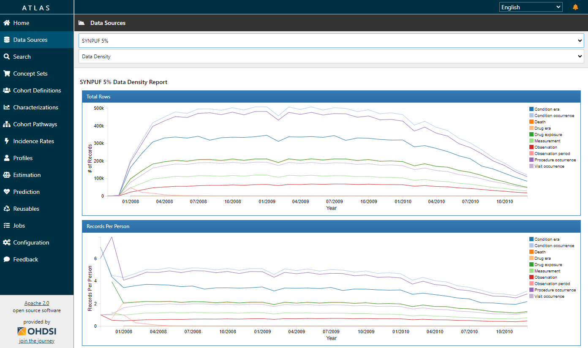

<H1> Betriebskonzept </H1>

Verantwortlich(e):  
Autor(en):  
Version:  
Datum:  

# Inhalt

[1 Zielsetzung [2](#zielsetzung)](#zielsetzung)

[2 Überblick [2](#überblick)](#überblick)

[2.1 Systemüberblick [2](#systemüberblick)](#systemüberblick)

[2.2 Schnittstellen [3](#schnittstellen)](#schnittstellen)

[3 Installation und Konfiguration
[3](#installation-und-konfiguration)](#installation-und-konfiguration)

[3.1 Server [3](#server)](#server)

[3.1.1 Installation [3](#installation)](#installation)

[3.1.2 Software Updates [3](#software-updates)](#software-updates)

[3.1.3 Releasewechsel [4](#releasewechsel)](#releasewechsel)

[3.1.4 Starten und Stoppen der Komponenten
[4](#starten-und-stoppen-der-komponenten)](#starten-und-stoppen-der-komponenten)

[3.2 Clients [4](#clients)](#clients)

[3.2.1 ATLAS [4](#atlas)](#atlas)

[3.2.2 Statistikprogrammierumgebung R
[4](#statistikprogrammierumgebung-r)](#statistikprogrammierumgebung-r)

[4 Nutzerverwaltung [4](#nutzerverwaltung)](#nutzerverwaltung)

[4.1 Rollen [4](#rollen)](#rollen)

[4.2 Nutzerverwaltungsprozess
[5](#nutzerverwaltungsprozess)](#nutzerverwaltungsprozess)

[5 Backup [5](#backup)](#backup)

[6 Wiederanlaufplan [5](#wiederanlaufplan)](#wiederanlaufplan)

[7 Verfügbarkeit [6](#verfügbarkeit)](#verfügbarkeit)

[8 Regelmäßige Tätigkeiten
[6](#regelmäßige-tätigkeiten)](#regelmäßige-tätigkeiten)

[8.1 Automatisch [6](#automatisch)](#automatisch)

[8.2 Manuell [6](#manuell)](#manuell)

[9 Externe Projektmitarbeiter
[6](#externe-projektmitarbeiter)](#externe-projektmitarbeiter)

[10 Kontinuierliche Verbesserung
[6](#kontinuierliche-verbesserung)](#kontinuierliche-verbesserung)

# Zielsetzung

Das vorliegende Dokument beschreibt alle Maßnahmen zum sicheren Betrieb
der unten beschriebenen Forschungsdatenbank in
\[…\] - im Folgenden „die Organisation“
genannt.

# Überblick

Die Verarbeitungstätigkeit umfasst eine Gesundheitsdatenbank auf Basis
des Observational Medical Outcomes Partnership (OMOP) Common Data Model
(CDM) und der damit verbundenen Tools des Observational Health Data
Sciences and Informatics (OHDSI) Programms. Beim OMOP CDM handelt es
sich um ein international abgestimmtes Datenbankschema, in dem Daten aus
der Krankenversorgung und der medizinischen Forschung in strukturierter
und standardisierter Form abgelegt und so der medizinischen Forschung
über einfach zu bedienende graphische Werkzeuge (OHDSI-Tools) zugängig
gemacht werden können. Um eine weltweite Vergleichbarkeit der Daten zu
erreichen, werden diese außerdem mit einer Reihe gängiger
Interoperabilitätsstandards repräsentiert, u.a. Logical Observation
Identifiers Names and Codes (LOINC) sowie Systematized Nomenclature of
Medicine (SNOMED) Clinical Terms (CT).

Die Forschungsdatenbank ermöglicht grundsätzlich die Bearbeitung einer
Vielzahl von wissenschaftlichen Fragestellungen auf Basis
hochstandardisierter und qualitätsgesicherter Daten aus der
Krankenversorgung. Im praktischen Einsatz ist das Spektrum an
Anwendungsfällen natürlich durch die in der Datenbank abgebildeten Daten
bestimmt. Ein wichtiger Vorteil der Nutzbarmachung von
„Real-World-Daten“ liegt darin, dass im Unterschied zu reinen
Forschungsdaten ein deutlich größerer, heterogenerer (damit klinisch
valider) Datensatz für Auswertungen zur Verfügung steht. Weiterhin
ermöglicht die Standardisierung der Daten, sich im Rahmen großer
internationaler Initiativen und Projekte, wie OHDSI und EHDEN, an
umfangreichen, weltweit durchgeführten Real-World-Evidence Studien zu
beteiligen, wobei die Anonymität der in der Datenbank abgebildeten
Patientinnen und Patienten strikt gewahrt bleibt. Neben den genannten
Netzwerken werden die Technologien von OHDSI zunehmend auch in weiteren
Projekten eingesetzt und bspw. im Rahmen von EU-Förderungen als
Grundlage empfohlen (für mehr Details zur OHDSI-Methodik, Netzwerken und
Tools siehe [\[1\]](#ref1)).

Ohne die Durchführung der in diesem Dokument beschriebenen
Verarbeitungstätigkeit ist die wissenschaftliche Sekundärnutzung von
Forschungsdaten nur eingeschränkt möglich. Insbesondere kann sich die
Organisation perspektivisch an großen Projekten und den internationalen
Real-World-Evidence-Netzwerken OHDSI und EHDEN nicht beteiligen. OHDSI
ist mit 160 Partneruniversitäten in 30 Ländern das größte
Real-World-Evidence-Netzwerk der Welt. Im Gegensatz zu einigen
kommerziellen Angeboten, die zunehmend auf den Markt drängen, ist es
offen und legt einen starken Wert auf Datenschutz. Weiterhin wird um
OHDSI herum eine lebendige Wissenschaftscommunity gepflegt, die in den
Jahren 2019-2020 ca. 80 technische und medizinische Publikationen
hervorgebracht hat. Die Organisation beraubt sich bei Nichtteilnahme
einer großen Chance und erleidet Wettbewerbsnachteile.

## Systemüberblick

\[Bitte beschreiben Sie die grobe Struktur der
(geplanten) Forschungsdatenbank. Nachfolgend wird ein Beispiel
beschrieben, welches übernommen oder entsprechend angepasst werden
kann.\]

Die Forschungsdatenbank ähnelt einem „Data Warehouse“, da Daten aus
Quellsystemen transformiert und repliziert geladen werden, um sie für
Auswertungen verfügbar zu machen. Weiterhin findet eine
Mandantentrennung in die verschiedene Krankheitsgruppen über die
Forschungsdatenbank Daten enthält statt, so dass Forschende immer nur
Zugriff auf Daten einer Krankheitsgruppe haben.

Sämtliche Komponenten der Datenbank sind Open Source Software und werden
auf \[Installationsort beschreiben/benennen\]
installiert. Dieser ist unter dem Domainnamen \[Name
der Domain\] zu erreichen. Die Komponenten sind im Einzelnen:

- \[Name des Datenbanksystems\]
  Datenbankserver

- OHDSI-ETL-Tools zur Transformation und zum Laden der Daten

- OHDSI WebAPI, die Webservices für andere OHDSI-Anwendungen zur
  Verfügung stellt

- OHDSI ATLAS, welches Forschenden die Möglichkeit der graphischen
  Datenanalyse bietet

Details zu den serverseitigen und clientseitigen OHDSI-Komponenten
finden sich in \[1\].

**Technische Verantwortliche und Kontakte**

- Technischer Verantwortlicher für die OHDSI-Installation:
  \[Name und Kontaktdaten\].

- Technischer Verantwortlicher für die genutzte IT-Infrastruktur:
  \[Name und Kontaktdaten\].

- Administration und Betrieb: \[Name und
  Kontaktdaten\].

**Fachliche Verantwortliche und Kontakte**

- \[Name und Kontaktdaten der fachlich verantwortlichen Person\] für Krankheitsgruppe \[X\].

- \[…\].

## Schnittstellen

\[Bitte beschreiben Sie die Schnittstellen des
(geplanten) Systems. Nachfolgend werden zwei Haupt-Schnittstellen
beschrieben, über welche das System in der Regel verfügt.\]

Das System verfügt über zwei Schnittstellen:

- Datenanlieferung: Hier werden Daten aus den Quellsystemen vorgehalten
  und für eine Übernahme in OHDSI in pseudonymisierter Form auf einem
  sicheren Netzlaufwerk abgelegt.

- OHDSI WebAPI: Die ins OMOP-CDM-Format transformierte Daten können von
  Forschenden und den OHDSI Tools über Web Services abgefragt werden.
  Dies geschieht Beispielsweise durch OHDSI Atlas oder über ein in der
  Statistikprogrammiersprache R geschriebenes Programm (siehe 3.2).

# Installation und Konfiguration

## Server

### Installation

Der genutzte Server erfüllt die Systemvoraussetzungen:

- \[Spezifikation des Servers und
  Betriebssystems\]

- \[z.B. 8-Kerne-CPU\]

- \[z.B. 16 GB RAM\]

Die Installation findet in Form von Docker mittels *Docker Compose*
statt. Weiterhin relevant für die Installation ist die Nutzung von
Zertifikaten, um verschlüsselte Verbindungen jederzeit zu gewährleisten.
Kanäle, die unverschlüsselte Kommunikation bieten (z.B. HTTP) werden
deaktiviert.

### Software Updates

\[Bitte beschreiben Sie den Prozess für
Software-Updates in Ihrem System. Erwähnen Sie beispielsweise, ob und
wenn ja, wie oft das Betriebssystem automatisch nach Updates sucht (z.B.
alle 24 Stunden) und wie Security Patches eingespielt werden. Klären
Sie, ob und wie manuelle Updates durchgeführt werden und in welchen
Abständen der Softwarestand des Servers überprüft wird. Geben Sie an, ob
diese Prüfungen automatisiert oder manuell erfolgen und wer für die
Durchführung verantwortlich ist.\]

Das Betriebssystem ist so konfiguriert, dass alle 24 Stunden eine
Prüfung auf und ggf. ein einspielen von Security Patches stattfindet.
Software Updates drüber hinaus finden nach Bedarf manuell statt. Der
Softwarestand des Servers wird regelmäßig manuell geprüft.

### Releasewechsel

\[Bitte beschreiben Sie den geplanten Prozess für
Releasewechsel, einschließlich der OHDSI-Komponenten und der Datenbank.
Falls aktuell kein Releasewechsel geplant ist, geben Sie dies an und
erläutern Sie, unter welchen Umständen ein Update erforderlich sein
könnte. Beschreiben Sie auch, wie solche Updates durchgeführt werden,
beispielsweise ob diese manuell oder automatisch erfolgen.\]

### Starten und Stoppen der Komponenten

\[Bitte erläutern Sie hier das Verfahren zum Starten
und Stoppen der relevanten Komponenten. Zum Beispiel kann Docker Compose
verwendet werden. Geben Sie die genauen Befehle an, die ausgeführt
werden müssen, wie „docker compose up“ zum Starten und „docker compose
down“ zum Stoppen der Komponenten. Fügen Sie auch zusätzliche Schritte
hinzu, die nach dem Starten oder Stoppen erfolgen sollten, wie
beispielsweise ein Neustart des Betriebssystems.\]

## Clients

### ATLAS

  
ATLAS ist eine Web-Anwendung, die eine
Möglichkeit bietet grafisch Datenanalysen durchzuführen (siehe
Abbildung 1) und mit einem Browser aufgerufen werden kann. Der Zugriff
auf die Daten ist über einen persönlichen Account sowie eine
verschlüsselte Verbindung geschützt. Für Details zu Atlas siehe \[1\].

### Statistikprogrammierumgebung R

Zugriff auf die Daten ist ebenfalls mittels der Programmiersprache R
möglich. OHDSI stellt hierfür eine Vielzahl von Softwarebibliotheken zur
Verfügung:

- HADES ist eine Sammlung von R-Paketen, die Funktionen bieten, die
  zusammen verwendet werden können, um eine vollständige
  Beobachtungsstudie, ausgehend von Daten im OMOP CDM, durchzuführen und
  Schätzungen und unterstützende Statistiken, Abbildungen und Tabellen
  zu erstellen.

- DATA QUALITY DASHBOARD verwendet eine harmonisierte Terminologie zur
  Bewertung der Qualität der Daten, die im OMOP CDM vorliegen.

- ACHILLES ist ein Software-Tool, das die Charakterisierung und
  Visualisierung einer CDM-konformen Datenbank ermöglicht.

Sämtliche Zugriffe über diese Tools und Bibliotheken sind ebenfalls über
einen persönlichen Account sowie eine verschlüsselte Verbindung
geschützt. Für allgemeine Details zu den Tools siehe \[1\].

# Nutzerverwaltung

## Rollen

Es existieren \[Anzahl der Rollen\] Rollen
beim Betrieb der Forschungsdatenbank:

\[Hier sind die Zugriffsberechtigungen der jeweiligen
Rollen pro System detailliert zu definieren. Die Rollen umfassen in der
Regel den Administrierenden sowie den Forschenden. Die Berechtigungen umfassen die Administrative Rechte, die
Schreib- sowie die Leseberechtigung. Die Beschreibung kann
beispielsweise in Form einer Kreuzmatrix oder einer einfachen Auflistung
geschehen.\]

A = Administrative Rechte, S = Schreibberechtigung, L = Leseberechtigung

<table>
<colgroup>
<col style="width: 6%" />
<col style="width: 57%" />
<col style="width: 12%" />
<col style="width: 12%" />
<col style="width: 12%" />
</colgroup>
<thead>
<tr class="header">
<th><strong>Nr.</strong></th>
<th><strong>Zugriffsberechtigung und Zweck</strong></th>
<th><blockquote>

<mark>[Rolle 1]</mark>

</blockquote></th>
<th><blockquote>

<mark>[Rolle 2]</mark>

</blockquote></th>
<th><blockquote>

<mark>[Rolle 3]</mark>

</blockquote></th>
</tr>
</thead>
<tbody>
<tr class="odd">
<td>1</td>
<td><mark>[Zugriff auf OHDSI-Daten; Zweck: Datenanalyse]</mark></td>
<td><mark>[…]</mark></td>
<td><mark>[…]</mark></td>
<td><mark>[…]</mark></td>
</tr>
<tr class="even">
<td>2</td>
<td><mark>[Zugriff auf … ]</mark></td>
<td><mark>[…]</mark></td>
<td><mark>[…]</mark></td>
<td><mark>[…]</mark></td>
</tr>
<tr class="odd">
<td>3</td>
<td><mark>[Zugriff auf … ]</mark></td>
<td><mark>[…]</mark></td>
<td><mark>[…]</mark></td>
<td><mark>[…]</mark></td>
</tr>
</tbody>
</table>

## Nutzerverwaltungsprozess

\[Bitte beschreiben Sie hier den
Nutzerverwaltungsprozess in Ihrer Organisation. Beziehen Sie sich auf
die Schritte zur Nutzerfreigabe, wie sie in [\[2\]](#ref2)  detailliert sind,
und passen Sie diese an Ihre spezifischen Anforderungen an. Erwähnen
Sie, wie Berechtigungen erteilt werden, und wie Anträge auf Nutzung der
Forschungsdatenbank gestellt und freigegeben werden. Gehen Sie auch auf
die Mandantentrennung ein, die Grenzen des Nutzungszeitraums und die
regelmäßige Überprüfung der Zugangsberechtigungen. Achten Sie darauf,
dass die beschriebenen Prozesse den Anforderungen Ihrer Organisation
entsprechen.\]

Zur Nutzerfreigabe ist pro Datensatz ein Prozess vorgesehen, der in
[\[2\]](#ref2) genauer beschrieben ist. Zusammenfassend:

3.  Forschende Personen stellen einen Antrag auf Nutzung der
    Forschungsdatenbank bei der Leitung der Fachabteilung.

4.  Die Leitung der Fachabteilung gibt diesen Antrag frei, nachdem
    Ethikvotum und Abstimmung mit den Datenschutzfunktionen erfolgt
    sind.

5.  Die forschende Person leitet den freigegebenen Antrag an die Administration weiter.

6.  Die Administration gewährt der forschenden Person Zugriff
    auf die Forschungsdatenbank.

Dabei findet eine Mandantentrennung statt. Dies bedeutet, dass
Forschende einer Fachabteilung ausschließlich Zugang zu Daten dieser
Fachabteilung erhalten. Eine Nutzerfreigabe kann immer nur bis zu einem
im Antrag definierten Ablaufdatum geschehen. Der Nutzungszeitraum pro
Studie ist auf maximal 6 Monate beschränkt. Weiterhin findet eine
regelmäßige Überprüfung der zugelassenen Personen durch die Administration statt.

# Backup

\[Bitte beschreiben Sie hier Ihren Backup-Prozess.
Erwähnen Sie, wie oft Backups erstellt werden (z.B. alle 12 Stunden) und
wie lange diese aufbewahrt werden (z.B. 30 Tage). Erklären Sie, welche
Systeme oder Daten gesichert werden und welche nicht. Beschreiben Sie
auch die Archivierung von Forschungsdaten und wie diese von den
Forschenden durchgeführt wird. Nachfolgend befindet sich ein
Beispiel.\]

Alle \[Hier Backup-Zyklus eintragen\] Stunden
findet ein automatisches Backup des Servers durch die zentrale
Infrastruktur statt. Die erstellten Backups werden
\[Hier Speicherdauer eintragen\] Tage
vorgehalten. Für die medizinischen Daten sind die Quellsysteme führend.
Diese werden dort gesichert. Deshalb ist eine Sicherung im Rahmen der
Forschungsdatenbank nicht notwendig. Die Forschungsdatenbank ist
lediglich für die Nutzerverwaltung und Konfiguration führend. Hier ist
ein Backup von 30 Tagen ausreichend, so dass kein weiteres Backup
notwendig ist. Eine Archivierung der für Forschungszwecke genutzten
Daten erfolgt separat durch die Forschenden unter Nutzung anderer
Angebote der Organisation.

# Wiederanlaufplan

\[Bitte beschreiben Sie den Wiederanlaufplan für Ihr
System im Falle eines unerwarteten Ausfalls. Erklären Sie, welche
Schritte unternommen werden müssen, um die Systemkomponenten wieder in
Betrieb zu nehmen. Beschreiben Sie auch die Maßnahmen, die bei Fehlern
zu ergreifen sind (z.B. Wiedereinspielen von Backups, Neustarten des
ETL-Prozesses). Nachfolgend befindet sich ein Beispiel.\]

Im Falle eines unerwarteten Systemausfalls müssen die Komponenten
zunächst mit „docker compose up“ gestartet werden. Der Startprozess
sollte überwacht und Logging-Dateien kontrolliert werden. Sollte es zu
Fehlern kommen kann (1) eine Wiedereinspielen des Backups in Betracht
gezogen werden oder (2) ein neu starten des ETL-Prozesses. Ersteres wäre
beispielsweise der Fall, wenn die Fehler sich auf fehlerhafte
Nutzerdaten beziehen, letzteres wenn die Fehler sich auf die
medizinischen Daten beziehen.

# Verfügbarkeit

\[Bitte definieren Sie hier die angestrebte
Verfügbarkeit Ihrer Forschungsdatenbank. Geben Sie die geplanten
Zugriffszeiten an. Erläutern Sie auch, wie mit geplanten Abweichungen
von diesem Zeitplan umgegangen wird, etwa bei Wartungsarbeiten.
Beschreiben Sie das Verfahren zur Benachrichtigung der registrierten
Nutzer über solche Änderungen, einschließlich der Fristen für die
Ankündigung. Nachfolgend befindet sich ein Beispiel.\]

Es wird angestrebt, dass ein Zugriff auf die Forschungsdatenbank für
Nutzung und Administration mindestens von Montag bis Freitag
von 08:00-20:00 Uhr möglich ist. Geplante Abweichungen von dieser
Verfügbarkeitsregel für beispielsweise Wartungsarbeiten werden
mindestens eine Woche vorher an alle registrierten User bekannt gegeben.

# Regelmäßige Tätigkeiten

## Automatisch

\[Bitte beschreiben Sie die automatisierten
Tätigkeiten, die regelmäßig in Ihrem System ausgeführt werden.
Nachfolgend befindet sich ein Beispiel.\]

Als regelmäßige, automatisierte Tätigkeit existiert lediglich ein
ETL-Prozess \[Falls zutreffend: je Mandant\].
Dieser lädt die angelieferten Daten, transformiert sie und lädt sie in
die Forschungsdatenbank. Eine Steuerung erfolgt über das Betriebssystem
der Forschungsdatenbank. Ein Ansteuern durch eine externe
Arbeitsvorbereitung/Job-Control ist nicht notwendig.

## Manuell

\[Bitte beschreiben Sie die manuellen Tätigkeiten,
die regelmäßig in Ihrem System ausgeführt werden. Nachfolgend befindet
sich ein Beispiel.\]

Es erfolgt eine Regelmäßige Prüfung des Systems manuell durch die
administrierenden Mitarbeiterinnen und Mitarbeiter.

# Externe Projektmitarbeiter

[Bitte geben Sie hier an, ob und zu welchem Zweck,
externe Projektmitarbeiter in die Installation, Einrichtung oder den
Betrieb der Forschungsdatenbank eingebunden sind. Nachfolgend befindet
sich ein Beispiel.]

Die Installation und Einrichtung der Forschungsdatenbank findet im
Rahmen des Pilotprojekts unter Einbezug von externen Mitarbeitern statt.
Hierbei werden sämtliche Vorgaben der Organisation bezüglich der
Einbindung externer Mitarbeiter eingehalten (siehe auch
\[…\]).

# Kontinuierliche Verbesserung

\[Hier wird ein grober Ansatz zur kontinuierlichen
Verbesserung der Forschungsdatenbank skizziert. Falls sich die
Forschungsdatenbank noch im Aufbau befindet, können künftig weitere
Informationen bei Bedarf in diesem Dokument ergänzt werden. Nachfolgend
befindet sich ein Beispiel.\]

Die Forschungsdatenbank OHDSI@\[...\] befindet
sich erst im Aufbau. Weitere Informationen zu Konfiguration und Betrieb
werden bei Bedarf in diesem Dokument ergänzt.

# Referenzen

\[1\] Observational Health Data Sciences and Informatics, The Book of OHDSI, 2021.https://ohdsi.github.io/TheBookOfOhdsi/.

\[2\] Berechtigungskonzept der Forschungsdatenbank OHDSI@\[Name der Organisation eintragen\].
