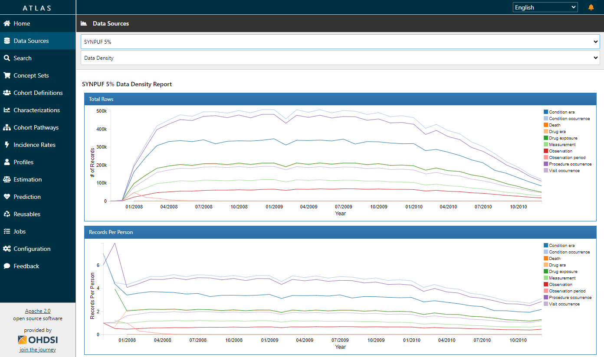
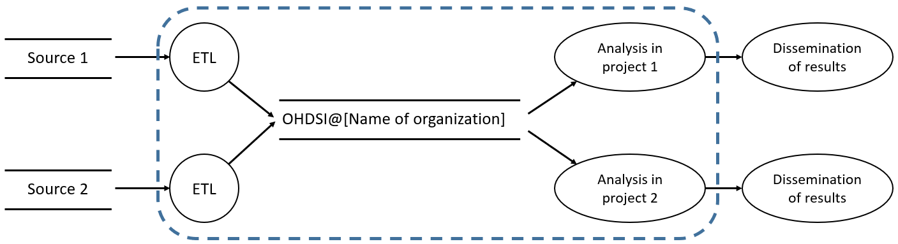

# Processing Activity Description: OHDSI Research Database

- **Responsible Person:** [Name]
- **Author:** [Name]
- **Date:** [DD.MM.YYYY]
- **Version:** [1.0]

## Contents

1. Overview
   * 1.1 Purpose of the Procedure
   * 1.2 Technical, Organizational, and Personnel Components
   * 1.3 Data, Sources, and Legal Bases
2. Systematic Description
   * 2.1 System and Software Components
   * 2.2 Processes
     * 2.2.1 Process 1: Transformation and Loading
     * 2.2.2 Process 2: Utilization of Analysis Tools
   * 2.3 Storage, Deletion, and Access
3. Protection of Affected Rights
   * 3.1 Information
   * 3.2 Revocation of Consent
   * 3.3 Access to Data
   * 3.4 Correction
   * 3.5 Deletion
   * 3.6 Restriction of Processing
   * 3.7 Data Portability
   * 3.8 Objection
4. References

## 1 Overview 

This document describes the setup of the research database based on the Observational Medical Outcomes Partnership (OMOP) Common Data Model (CDM) and the associated tools of the Observational Health Data Sciences and Informatics (OHDSI) initiative. The OMOP CDM is an internationally coordinated database schema for storing data from healthcare and medical research in a structured and standardized form, thereby making it accessible to medical research through easy-to-use graphical tools. To achieve cross-institutional comparability of data, semantics are standardized using common terminology standards, such as Logical Observation Identifiers Names and Codes (LOINC) or the Systematized Nomenclature of Medicine (SNOMED) Clinical Terms (CT).

Generally, the research database enables answering a variety of scientific questions based on standardized and quality-assured data. In practice, the spectrum of possible use cases is determined by the data contained in the OMOP CDM. A key advantage of utilizing "real-world data" is that, unlike with research data only, a much larger, more heterogeneous, and thus clinically more valid dataset can be evaluated. Moreover, the standardization performed facilitates participation in large international initiatives like OHDSI, involving cross-institutional studies based on federated analyses and the exchange of non-personal analysis results [1].

### 1.1 Purpose of the Processing Activity

The research database provides researchers of the organization with features for the scientific use of pseudonymized data from healthcare and research. Key functionalities include: (1) Identification of data quality issues, (2) Use of OHDSI tools for data analysis using common statistical methods, (3) Participation in large, international research projects based on the exchange of aggregated analysis results, maintaining the anonymity of affected individuals.

Data analyses typically occur on the basis of formally defined research projects.

[_Note: Local specifics, such as the need for ethics votes or study protocols, can be added here._]

### 1.2 Technical, Organizational, and Personnel Components

Relevant medical data is collected outside of the context of the OHDSI research database. This also applies to the integration and pseudonymization of data, which is carried out by the organization's data integration platform.

[_Note: Describe specifics if your setup is different._]

The OHDSI research database primarily consists of the following components:
- A PostgreSQL database with the OMOP CDM for storing pseudonymized medical data.
- Another PostgreSQL database for storing configuration options and study designs.
- Apache SOLR for searching available vocabularies.
- OpenLDAP for authentication and authorization.

Based on this basic infrastructure, the following applications are provided:
- WebAPI, a RESTful API for accessing and analyzing data stored in the OMOP CDM.
- ATLAS (see screenshot), a web-based tool for conducting scientific analyses.
- ARES, a system for characterizing and assessing the quality of data.
- RStudio for data analysis using the R statistical programming language.

All these components operate on a virtual machine within the highly protected internal network of the organization. The software solutions can only be used through computers that are approved for processing pseudonymized research data according to the organization's central guidelines and connected through encrypted channels (HTTPS or SSH).

[_Note: The previous paragraph can be adapted if needed. Alternatively, the research database may also be operated in a demilitarized zone or a research network and may use dedicated hardware. Technical access options might be regulated differently at your institution. It is recommended to include a reference to the respective technical and organizational safeguards implemented. Technical differences, such as using database management systems other than PostgreSQL, may also require corresponding adjustments._]

The dissemination of the results of analyses, for example in the form of publications, takes place, following the use of the OHDSI tools. This process is the responsibility of the researchers and may include the use of the organization's research services for archiving primary data. The data in the research database itself is secured by the standard backup mechanism of the underlying virtual machine environment. Thus, the setup complies with all policies of the organization.

[_Note: Specifics, such as details about the responsibility for the underlying infrastructure, and institutional specifics, for example in regards to archiving, should be described here._]

The following groups of people are involved in the setup, operation, and use of the research database. Groups operating components outside the scope of the research database, such as basic infrastructure or source systems, are not listed here.

| Group of People            | Tasks                                                                        |
|----------------------------|------------------------------------------------------------------------------|
| Technical Administrators   | Setup and operation of machines, software components, and ETL processes      |
| Domain Administrators      | Quality checks, provision and maintenance of researcher access               |
| Researchers                | Use of OHDSI tools for conducting research projects                          |

[_Note: The groups of people listed can be adapted according to local needs. For example, it is possible that domain administration might also be covered by technical administration, or that separate roles for designing and running ETL processes as well as technical administration are foreseen._]

### 1.3 Data, Sources, and Legal Bases

In the OHDSI research database, various types of medical data are used for research purposes. Moreover, the environment manages data for operational purposes, such as user accounts. The following table provides an overview of the types of data used, their source systems, and the legal basis for processing.

| Type of Data   | Source                         | Legal Basis    |
|----------------|--------------------------------|----------------|
| Demographics   | Hospital Information System    | Consent        |
| Diagnoses      | Hospital Information System    | Consent        |
| Procedures     | Hospital Information System    | Consent        |
| Lab Data       | Laboratory Information System  | Consent        |
| User Accounts  | Central User Administration    | Employment Contract |

[_Note: The table should be adapted according to the types of data, data sources, and legal bases used in your installation. If the OHDSI research database operates in a multi-tenancy mode, different types of data may be made accessible to different groups of researchers. This can be described in more detail in the following section. Instead of the generic mentioning of "Consent" or other legal bases, these should be described in detail. Subsections or appendices can also be used for this purpose._]

## 2 Systematic Description

### 2.1 System and Software Components

In this section, the major system and software components of the OHDSI research database are listed in tabular form. Access permissions are described in regards to the groups of people described in the previous section.

| System Component       | Authorized Group of People                           |
|------------------------|------------------------------------------------------|
| Virtual Machine        | Technical Administrators                             |

| Software Component     | Authorized Group of People                           |
|------------------------|------------------------------------------------------|
| Operating System       | Technical Administrators                             |
| ETL Tool               | Technical Administrators                             |
| PostgreSQL Database    | Technical Administrators                             |
| Apache SOLR            | Technical Administrators                             |
| OpenLDAP               | Technical Administrators, Domain Administrators      |
| WebAPI                 | Domain Administrators, Researchers                   |
| ATLAS                  | Domain Administrators, Researchers                   |
| ARES                   | Domain Administrators, Researchers                   |
| RStudio                | Domain Administrators, Researchers                   |

[_Note: The table should be adapted according to local specifics. For example, OHDSI does not dictate the implementation of the ETL process, thus the "ETL Tool" needs to be described in more detail._]

### 2.2 Processes

A structured description of the relevant system components and data flows is illustrated below using a LINDDUN Data Flow Diagram [2]:

[_Note: The diagram should be adapted to local specifics. A LINDDUN Diagram is a specialized form of a data flow diagram specifically developed for the analysis and visualization of security and privacy risks in software architectures. An introduction and a description of the syntax can be found in [2]._]

The scope of this document is indicated in the diagram and encompasses the ETL processes as well as the use of data and tools. Since the steps for each of the individual processes only differ in details, such as transformation rules, they are described in a combined form below.

#### 2.2.1 Process 1: Transformation and Loading

- **Process Description:** Pseudonymized data are transformed into the structure of the OMOP CDM and mapped to corresponding terminology codes. Subsequently, they are loaded into the database.

- **Involved Groups of People:** Technical Administrators.

- **Involved Components:** Virtual Machine, Operating System, ETL Tool, PostgreSQL Database.

- **Involved Data Categories:** Demographics, Diagnoses, Procedures, Lab Data.

#### 2.2.2 Process 2: Utilization of Analysis Tools

- **Process Step Description:** Quality assessment and analysis of the pseudonymized data using ARES, ATLAS, and RStudio.

- **Involved Groups of People:** Researchers.

- **Involved Components:** ARES, ATLAS, and RStudio.

- **Involved Data Categories:** Dependent on the project.

[_Note: The process list should be adapted to local specifics, as well as components, data types, and groups of people._]

[_Note: If commissioned data processing takes place as part of establishing or maintaining the OHDSI research database, it is recommended to detail this here and refer to the corresponding contracts. Common services in the context of OHDSI include the operation of infrastructure or database, as well as the implementation of ETL processes._]

### 2.3 Storage, Deletion, and Access

| Data Category | Storage Location | Storage Duration                           | Access                                                       |
|---------------|------------------|--------------------------------------------|--------------------------------------------------------------|
| Demographics  | PostgreSQL       | According to local regulations             | Technical Administrators, Domain Administrators, Researchers |
| Diagnoses     | PostgreSQL       | According to local regulations             | Technical Administrators, Domain Administrators, Researchers |
| Procedures    | PostgreSQL       | According to local regulations             | Technical Administrators, Domain Administrators, Researchers |
| Lab Data      | PostgreSQL       | According to local regulations             | Technical Administrators, Domain Administrators, Researchers |
| User Accounts | OpenLDAP         | Contract termination or account expiration | Technical Administrators, Domain Administrators              |

[_Note: The table must be adapted and extended according to local regulations regarding storage durations and access._]

## 3 Protection of Subject Rights

[_Note: Patients and study participants typically have a range of rights regarding their personal data, which are anchored in various legal frameworks. This section and its subsections refer to the EU General Data Protection Regulation and must be adapted accordingly to local specifics._]

Measures for the realization of subjects rights can be taken by authorized users. It is important to note that all changes in the source systems are automatically reflected in the data in the research database through synchronization.

### 3.1 Information

Patients are extensively informed about the OHDSI research database as part of the consenting process.

[_Note: This section should describe how the organization informs patients about the processing of their personal data. Reference can be made to information brochures, consenting processes, or privacy statements._]

### 3.2 Revocation of Consent

Subjects can revoke their consent to data processing at any time. This does not affect the processing up to the time point of revocation. To revoke, the subject must send an informal note via email or postal services. The necessary contact details can be found in the consent form. Upon receipt of the revocation, the subject's data will no longer be delivered by the data integration platform to the OHDSI research database.

[_Note: This section should explain how subjects can revoke their consent to data processing. If data processing is not based on consent, the corresponding legal basis can be described instead._]

### 3.3 Access to Data

To request access to data, subjects can directly contact the institution's data protection officer. Additionally, the contact address mentioned in the consent form can also be used.

[_Note: Here, it should be described how data subjects can exercise their right for access to data, including the contact details of the responsible authorities._]

### 3.4 Correction

To initiate a correction request, data subjects can directly contact the institution's data protection officer. Corrections in the source systems are automatically transferred to the research database through synchronization.

[_Note: This should be adapted to local circumstances._]

### 3.5 Deletion

To initiate a deletion request, data subjects can directly contact the institution's data protection officer or use the contact details provided in the consent form. Deletions are synchronized from the source systems to the research database or implemented via a deletion flag.

[_Note: This should be adapted to local circumstances._]

### 3.6 Restriction of Processing

To request restriction of processing, data subjects can directly contact the institution's data protection officer or use the contact details provided in the consent form. If the request is justified and exclusively related to the research database, the restriction will be implemented. In the case of a restriction in the source systems, this will automatically affect the data in the research database through synchronization.

[_Note: This should be adapted to local circumstances._]

### 3.7 Data Portability

In the case of a legitimate request for access to data, the processed data related to a subject can be printed and provided as a formal letter. Additionally, a technical transmission is possible. It is important to note that although the data in the OHDSI research database may be in a different technical format, they semantically correspond with the data in the source systems, allowing them to also be used as a source for data transfer.

[_Note: This should be adapted to local circumstances._]

### 3.8 Objection

Since the data in the OHDSI research database is processed on a legal basis, subjects have the right to object. This can lead to deletion in the source systems or exclusively in the research database (see section on deletion).

[_Note: This should be adapted to local circumstances._]

## 4 References

[1] Observational Health Data Sciences and Informatics, The Book of OHDSI, 2020.

[2] Deng, M., Wuyts, K., Scandariato, R., Preneel, B., & Joosen, W. (2011). A privacy threat analysis framework: supporting the elicitation and fulfillment of privacy requirements. Requirements Engineering, 16(1), 3-32.

[3] Authorization Concept: OHDSI Research Database.
