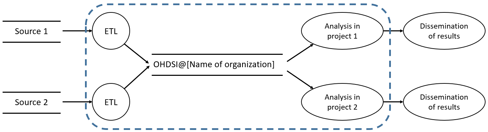

# Information Security Concept: OHDSI Research Database

- **Responsible Person:** [Name]
- **Author:** [Name]
- **Date:** [DD.MM.YYYY]
- **Version:** [1.0]

## Contents

1. Overview
2. Protection Requirements and Risk Assessment
   * 2.1 Protection Requirements
   * 2.2 Risk Assessment
     - 2.2.1 Process 1: Data Transformation and Loading
     - 2.2.2 Process 2: Data Usage
3. Measures
   * 3.1 Access Control
   * 3.2 Media Control
   * 3.3 Storage Control
   * 3.4 User Control
   * 3.5 Access Control
   * 3.6 Transmission Control
   * 3.7 Input Control
   * 3.8 Transport Control
   * 3.9 Recoverability
   * 3.10 Reliability
   * 3.11 Data Integrity
   * 3.12 Order Control
   * 3.13 Availability Control
   * 3.14 Separability
4. References

## 1 Overview

The OHDSI Research Database processes special categories of personal data, namely health data. The aim of this document is to describe the technical and organizational measures taken to ensure the security objectives of confidentiality, integrity, and availability.

## 2 Protection Requirements and Risk Assessment

### 2.1 Protection Requirements

The OHDSI Research Database manages two main types of personal data: (1) health data, (2) user data. Furthermore, the database exists for one specific purpose: to enable statistical analyses for medical research. Details are provided in the description of the processing activity [4]. Due to this specific focuses, the protection requirements will be analyzed for a combination of all components of the database and rated on a scale of low, medium, and high.

The confidentiality of the health data is of central importance. However, as the data are already pseudonymized before being processed, a medium level of required protection is assumed. The integrity of the data is important, but a violation would have less severe consequences in research than in healthcare (protection requirement: medium). The availability of the data is less critical, as research activities can be postponed (protection requirement: low). The protection requirements of user data are high in terms of confidentiality and integrity, as unauthorized access and misuse must be prevented. The requirement for availability can be considered low. The same requirements hold for all components of the OHDSI Research Database.

### 2.2 Risk Assessment

The risk assessment performed for determining the necessary additional measures to be implemented is based on the methods of the European Union Agency for Cybersecurity (ENISA) [1] and the IT baseline protection of the German Federal Office for Information Security (BSI), i.e., the methodology of BSI Standard 200-3 [2]. The assessment includes an analysis of the expected frequencies and impact of identified threats. The following 3x3 risk matrix is then used to derive a risk estimate:

|                                 |         | **Impact Level** | **Impact Level** | **Impact Level** |
|---------------------------------|---------|------------------|------------------|------------------|
|                                 |         | Low              | Medium           | High             |
| **Frequency of Occurrence**     | Low     | Low Risk         | Medium Risk      | High Risk        |
| **Frequency of Occurrence**     | Medium  | Low Risk         | Medium Risk      | High Risk        |
| **Frequency of Occurrence**     | High    | Medium Risk      | High Risk        | High Risk        |

[_Note: Alternatively, an individually suitable approach for risk analysis can be chosen. It is recommended to first check if there is an internal methodology recommended within the organization._]

Impacts can include technical (e.g., loss of system availability) and business (e.g., loss of reputation) damages [1]. In this document, the impact level is determined based on the results of the protection requirements assessment. To estimate the probability of occurrence, various aspects such as the given circumstances, previous organizational or institution-specific experiences, and general statistics can be considered [1]. Key points for risk analysis arise from the objectives to be considered, threats, and protective measures. The main information security objectives and significant identified threats to these objectives are presented below [1].

| Objective           | Threat                                      |
|---------------------|---------------------------------------------|
| Confidentiality     | Unauthorized data access.                   |
| Integrity           | Undesired data alteration.                  |
| Availability        | Data loss or IT system failure.             |

The risk assessment was performed based on the main processes supported, which are shown in the following LINDDUN Data Flow Diagram [3]:

[_Note: The diagram should be adapted to local conditions. A LINDDUN Diagram is a specialized form of a data flow diagram developed specifically for analyzing and visualizing privacy risks in software architectures. An introduction and description of the syntax can be found in [3]._]

### 2.2.1 Process 1: Data Transformation and Loading

In this process, already pseudonymized data are transformed into the schema of the OMOP Common Data Model (CDM), mapped to terminologies, and loaded into the research database.

- **Confidentiality**: The probability of a breach of data confidentiality is considered low due to strict access and control and a limited set of users. The impact level determined by the protection requirements assessment is medium. This leads to a medium risk.

- **Integrity**: The probability of a breach of data integrity is considered low, with a medium level of impact. This leads to a medium risk.

- **Availability**: A restriction of the availability of the research database is occasionally possible due to maintenance work and low redundancy. The frequency of occurrence is therefore medium. The impact level is low based on the protection requirements assessment. This leads to a medium risk.

In summary, the following risk assessment is made for the transformation and loading process:

| Assurance Objective | Probability of Occurrence | Impact       | Risk            |
|---------------------|---------------------------|--------------|-----------------|
| Confidentiality     | Low                       | Medium       | Medium Risk     |
| Integrity           | Low                       | Medium       | Medium Risk     |
| Availability        | Medium                    | Low          | Medium Risk     |

[_Note: The evaluation may need to be adapted to your own assessments._]

### 2.2.2 Process 2: Data Usage

In this process, pseudonymized data and OHDSI data analysis tools are used for research purposes.

- **Confidentiality**: The probability of a breach of data confidentiality is considered low due to strict access and control and a limited set of users. The impact level determined by the protection requirements assessment is medium. This leads to a medium risk.

- **Integrity**: The probability of a breach of data integrity is considered low, with a medium level of impact. This leads to a medium risk.

- **Availability**: A restriction of the availability of the research database is occasionally possible due to maintenance work and low redundancy. The frequency of occurrence is therefore medium. The impact level is low based on the protection requirements assessment. This leads to a medium risk.

In summary, the following risk assessment is made for the data usage process:

| Assurance Objective | Probability of Occurrence | Impact       | Risk            |
|---------------------|---------------------------|--------------|-----------------|
| Confidentiality     | Low                       | Medium       | Medium Risk     |
| Integrity           | Low                       | Medium       | Medium Risk     |
| Availability        | Medium                    | Low          | Medium Risk     |

[_Note: The evaluation may need to be adapted to your own assessments._]

## 3 Measures

The OHDSI Research Database is operated in the highly secured internal network of the organization and is only accessible to employees of the organization. Therefore, all central organizational and technical measures apply and already provide strong general protection.

[_Note: This paragraph must be adapted according to the local specifics and the technical characteristics of the installation as laid out in the description of the processing activity._]

This document lists only specific technical and organizational measures for the OHDSI Research Database.

[_Note: The rest of this paragraph and the further content are based on the BSI IT baseline protection, which is particularly relevant in Germany, and may need to be adapted according to local policies or specifics._]

The IT baseline protection of the BSI [2] summarizes common security measures into various modules, of which the most important for the OHDSI Research Database are briefly described below:

- **Module Organization and Personnel – "ORP"**: This module describes security measures such as organization (ORP.1), personnel (ORP.2), and awareness and training for information security (ORP.3).

- **Module Concept and Procedure – "CON"**: This module describes security measures such as data protection (CON.2) or deletion and destruction (CON.6).

- **Module Operation – "OPS"**: This module describes security measures such as proper IT administration (OPS.1.1.2), patch and change management (OPS.1.1.3), and protection against malware (OPS.1.1.4).

- **Module Detection and Reaction – "DER"**: This module describes security measures such as detection of security-relevant events (DER.1) and handling of security incidents (DER.2.1).

- **Module Applications – "APP"**: This module describes security measures for various application components such as web applications (APP.3.1) or Active Directory (APP.2.2).

- **Module IT System – "SYS"**: This module describes security measures for various IT systems such as servers under Linux and Unix (SYS.1.3) or virtualization (SYS.1.5).

- **Module Networks and Communication – "NET"**: This module describes security measures for networks such as network management (NET.1.2) or VPN (NET.3.3).

- **Module Infrastructure – "INF"**: This module describes security measures for infrastructure such as general buildings (INF.1) or data centers and server rooms (INF.2).

### 3.1 Access Control

Measures from the following modules have been implemented: Identity and Access Management (ORP.4) and Active Directory (APP.2.2). A central group concept is used for access control to the operating system, database, and web interface. The groups have different permissions for reading, deleting, and editing, as well as different permissions for the operating system, database, and web interface. The implementation is based on Active Directory. Access rights are documented internally and granted per person [6]. Furthermore, all central technical and organizational measures apply.

[_Note: Adapt if necessary._]

### 3.2 Media Control

Measures from the following modules have been implemented: Backup Concept (CON.3) and Storage Solutions (SYS.18). Only centrally provided services are used for the storage infrastructure of the research database. Non-electronic media are not used. Furthermore, all central technical and organizational measures apply.

[_Note: Adapt if necessary._]

### 3.3 Storage Control

Measures from the following modules have been implemented: Backup Concept (CON.3) and Storage Solutions (SYS.18). Access to storage relevant to the research database is only granted to authorized researchers and administrators on a strict "need-to-know" basis. Pseudonymization of the data takes place in a step preceding this processing activity. Furthermore, all central technical and organizational measures apply.

[_Note: Adapt if necessary._]

### 3.4 User Control

Measures from the following modules have been implemented: Identity and Access Management (ORP.4) and Logging (OPS.1.1.5). Measures described in the section on access control are also relevant for this security objective. Additionally, the research database manages logs when adding and deleting users. Access is granted only on an application basis. Furthermore, all central technical and organizational measures, such as locking accounts of users that left the institution or that have been compromised and the central password policy, apply.

[_Note: Adapt if necessary._]

### 3.5 Access Control

Measures from the following modules have been implemented: Awareness and Training for Information Security (ORP.4) and Proper IT Administration (OPS.1.1.2). Access control ensures that the correct rights are assigned to the respective roles. Measures described in the section on access control are also relevant for this security objective. Additionally, permissions are granted only on a fine-grained basis, and access to personal data is reduced to the necessary extent ("need-to-know"). A defined on- and offboarding process for accesses to the research database has been established. Also, there is a separation of roles into administrators and users. Users only have user rights, administrators use administrative rights only for administration-related activities. Furthermore, all central technical and organizational measures apply.

[_Note: Adapt if necessary._]

### 3.6 Transmission Control

Measures from the following modules have been implemented: Logging (OPS.1.1.5) and Crypto Protection (CON.1). Transmission control aims to log who transferred which (pre-existing) personal data to other locations and when. The following measures are implemented to ensure this: The transmission of personal data is only supported by defined processing systems. The connection between these systems is always encrypted. This applies to both the automatic exchange between systems ("ETL processes") and requests from users. There is no transfer of data beyond the defined analytical capabilities. Furthermore, all central technical and organizational measures apply.

[_Note: Adapt if necessary._]

### 3.7 Input Control

Measures from the following modules have been implemented: Logging (OPS.1.1.5) and Proper IT Administration (OPS.1.1.2). Data entry takes place exclusively automatically and performed by IT systems ("ETL process"). Changes to the data are described in corresponding audit trails, and can oonly be made with according permissions (see section 3.1). Furthermore, all central technical and organizational measures apply.

[_Note: Adapt if necessary._]

### 3.8 Transport Control

Measures from the following modules have been implemented: Crypto Protection (CON.1) and Network Management (NET.1.2). To ensure confidentiality, data is only transmitted in encrypted form. Server certificates are used to verify the authenticity of the machines communicating. Physical transport of data does not happen. Furthermore, all central technical and organizational measures apply and, for example, guarantee that servers can only be accessed from the internal network.

[_Note: Adapt if necessary._]

### 3.9 Recoverability

Measures from the following modules have been implemented: Data Security Concept (CON.3) and Archiving (OPS.1.2.2). The central backup service of the virtual server environment is used. Additionally, a system-specific operational concept (see [5]) defines how recovery from the backups of the central service can be done. All central technical and organizational measures also apply.

[_Note: Adapt if necessary._]

### 3.10 Reliability

Measures from the following modules have been implemented: Patch and Change Management (OPS.1.1.3) and Handling Security Incidents (DER 2.1). The research database is configured so that security patches are regularly installed automatically. Details are described in the operational concept [5]. The central backup service of the virtual server environment is also used. Furthermore, central technical and organizational measures apply, such as automatic monitoring of systems with suitable tools and securing data centers with uninterruptible power supplies and emergency power generators.

[_Note: Adapt if necessary._]

### 3.11 Data Integrity

Measures from the following modules have been implemented: Virtualization (SYS.1.5) and Storage Solutions (SYS.1.8). Measures described in the Reliability section are also relevant for this security objective. Additionally, only transaction-safe systems are used at the for data storage. Fault-tolerant transmission protocols are also used, allowing data to be resent in case of a failed transmission. Central technical and organizational measures apply, such as minimizing malfunctions at the server/hardware level through the use of virtual infrastructure or secure central storage.

[_Note: Adapt if necessary._]

### 3.12 Order Control

No external service providers are used.

[_Note: If external service providers are used, aspects such as secure server access and commissioned data processing contracts can be mentioned here._]

### 3.13 Availability Control

Measures from the following modules have been implemented: Virtualization (OPS.1.5) and Emergency Management (DER.4). Availability control is ensured by the measures mentioned above regarding recoverability, data integrity, and reliability. The virtual infrastructure provides a highly available environment based on the necessary data centers and network infrastructure. The authorization concept also contributes to availability control, as it prevents unintentional deletion or destruction of personal data. Furthermore, all central technical and organizational measures apply.

[_Note: Adapt if necessary._]

### 3.14 Separability

Measures from the following modules have been implemented: Data Protection (CON.2) and Development of Web Applications (CON.10). Measures described in the Access Control section are also relevant for this security objective. The database is used exclusively for research purposes. Pseudonymization of the data also takes place before data is handled by the database. Furthermore, all central technical and organizational measures apply.

[_Note: Adapt if necessary. If multi-tenancy is implemented, for example, this can be included here._]

## 4 References

[1] European Union Agency For Network and Information Security, Handbook on Security of Personal Data Processing. 2017.

[2] Federal Office for Information Security, Information Security and IT Baseline Protection, Bonn: Reguvis Fachmedien, 2017.

[3] Deng, M., Wuyts, K., Scandariato, R., Preneel, B., & Joosen, W. (2011). A privacy threat analysis framework: supporting the elicitation and fulfillment of privacy requirements. Requirements Engineering, 16(1), 3-32.

[4] Processing Activity Description: OHDSI Research Database.

[5] Operational Concept: OHDSI Research Database.

[6] Authorization Concept: OHDSI Research Database.
